# Header

Behaviour documentation for the global header on customink.com.

Routes covered: `/` (homepage), internal pages, `/cart`, `/checkout/*`, `/lab` (redirects to `/ndx/`). Guest and logged-in states.

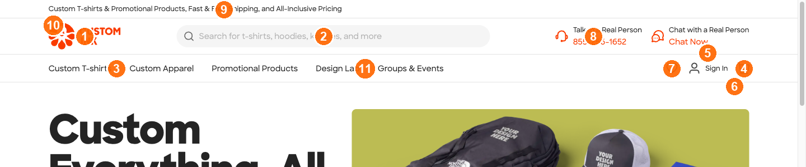

The numbered markers on the screenshot above match the numbered sections below:
**1** Logo · **2** Search · **3** Mega-menu triggers (Custom T-shirts, Custom Apparel, Promotional Products, Design Lab, Groups & Events; marker placed on the first) · **4** Cart · **5** Sign In · **6** Open Sign In / My Account caret · **7** Favorites · **8** Phone · **9** Promo strip · **10** Skip link (visible only on Tab) · **11** Design Lab mega-menu trigger (also reachable via §11 below).

## Host elements

- `<ci-header-prerender>` — homepage only (server-prerendered for fast paint).
- `<ci-header>` — every other route. Renders in three observable modes:
  - default (full chrome on internal pages),
  - `show-cart="false"` on `/cart` and `/checkout/*`,
  - `simple="true" cart-detail cart-pricing use-popup-login` on `/ndx/` (Design Lab).
- `<ci-punchout-banner>` — present in the DOM across multiple routes; empty container unless a B2B punchout session is active.

Neither host element exposes `role="banner"`. See [ADR-003](../adr/003-header-root-selector.md) for the root-selector decision.

\newpage

## 1. Logo

CustomInk wordmark on the far left of the header. Accessible name `customink logo - inky` (the mascot tag is part of the name).

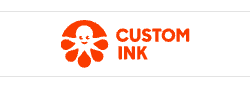

### Click behaviour

- When the user clicks the logo from any route, the browser navigates to `/`.
- `Cmd`-click or `Ctrl`-click opens `/` in a new tab without leaving the current route.
- The logo href is the absolute URL `https://www.customink.com`, not a relative `/`.

### Cross-context behaviour

- The logo renders on every route, including `/cart`, `/checkout/*`, `/ndx/` (Design Lab), and 404 pages.
- Returning to `/` from an internal page re-mounts the header host as `<ci-header-prerender>` instead of `<ci-header>`.

### Known issues

- None tracked.

\newpage

## 2. Search

Search field in the main header band with an autocomplete listbox. Powered by Algolia.

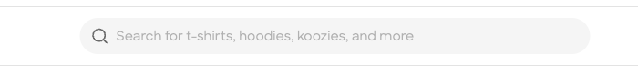

### Typing and autocomplete

- When the user types two or more characters, the autocomplete listbox opens within ~5 s (Algolia round-trip).
- `ArrowDown` moves the highlight through suggestions; `Enter` navigates to the highlighted suggestion's destination URL.
- `Escape` while the listbox is open closes it; the search field retains its value.
- Submitting a typed query directly (without picking a suggestion) navigates to a results URL whose path or query string reflects the term.

### Empty and degenerate input

- Submitting an empty query does not navigate; the current URL is preserved.
- Whitespace-only input behaves like an empty submit.
- Oversized input does not crash the field; the field either truncates or accepts and submits.
- A query with no Algolia matches (e.g. `qpzwxqp`) lands on a results page that explicitly says no results — never silently falls back to `/`.

### Per-route presence

- Homepage and internal pages: search field is visible.
- `/cart` and `/checkout/*`: the search field renders (it is **not** suppressed despite `<ci-header show-cart="false">`).
- `/ndx/` (Design Lab): no search field — `simple="true"` strips it.
- Mobile (≤ 375 px): the field collapses behind an icon-button combobox with the accessible name `Search for t-shirts, hoodies, koozies, and more`. The actual input does not render until the user activates the button.

### Known issues

- None tracked.

\newpage

## 3. Primary-nav mega-menus

Five top-level catalog triggers in the header's primary-nav row. Hover opens a panel below the row; click on the trigger label navigates to the category landing page.

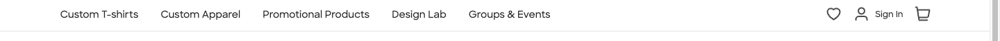

### Trigger shape

- Four of the five render as `<a>` (clickable category link) plus an adjacent caret `<button>` (mega-menu trigger). The caret click is intercepted by the link — the user-equivalent way to open the panel is to hover the link, not click the caret.
- `Groups & Events` renders as `<button>`-only with no `<a>` companion. To open the panel, hover the button directly.

### Open and close

- Hovering a top-level trigger expands its mega-menu panel; the trigger's `aria-expanded` becomes `"true"`.
- Hovering a different top-level trigger while a panel is open closes the first panel before the second opens — there is no panel-stacking.
- `Escape` while a panel is open closes the panel — but only when the trigger has keyboard focus, not when the panel is held open by mouse hover.

### Per-route presence

- Homepage and internal pages: all five triggers render.
- `/cart` and `/checkout/*`: mega-menus **remain visible** (the `show-cart="false"` attribute hides the cart icon but not the primary nav).
- `/ndx/` (Design Lab): primary nav is removed entirely by `simple="true"`.
- Mobile (≤ 375 px): mega-menus are disabled. The primary nav reflows out of `<header>` into `<main>` as a flat link list with no hover expansion.

### Custom T-shirts

Trigger href `/products/t-shirts/4`. Subcategory items in the panel:

- Short Sleeve T-shirts → `/products/t-shirts/short-sleeve-t-shirts/16`
- Long Sleeve T-shirts → `/products/t-shirts/long-sleeve-t-shirts/17`
- Tank Tops & Sleeveless → `/products/t-shirts/tank-tops-sleeveless/18`
- Performance Shirts → `/products/t-shirts/performance-blend-shirts/505`
- Soft Tri-Blend T-shirts → `/products/t-shirts/soft-tri-blend-t-shirts/399`
- Sustainable T-shirts → `/products/sustainable/sustainable-t-shirts/773`
- Women's T-shirts → `/products/t-shirts/womens-t-shirts/104`
- Kids T-shirts → `/products/t-shirts/kids-t-shirts/197`
- No Minimum T-shirts → `/products/no-minimum/t-shirts/97?min_qty[]=1`
- View All Custom T-shirts → `/products/t-shirts/4`

### Custom Apparel

Trigger href `/products/apparel/857`. Subcategory items in the panel:

- Hoodies → `/products/sweatshirts/hoodies/71`
- Crewneck Sweatshirts → `/products/sweatshirts/crewneck-sweatshirts/120`
- Quarter Zip Sweatshirts → `/products/sweatshirts/quarter-zip-sweatshirts/224`
- View All Sweatshirts → `/products/sweatshirts/13`
- Baseball Hats → `/products/hats/baseball-hats/3`
- Trucker Hats → `/products/hats/trucker-hats/201`
- Beanies → `/products/hats/beanies/39`
- View All Hats → `/products/hats/1`
- Jackets → `/products/jackets-outerwear/14`
- Polo Shirts → `/products/polos/148`
- Business Apparel → `/products/business-apparel/147`
- Workwear & Uniforms → `/products/workwear-uniforms/149`
- Activewear → `/products/activewear/44`
- Team Jerseys → `/products/team-jerseys/425`
- Pants & Shorts → `/products/pants-shorts/178`
- Accessories → `/products/accessories/574`

### Promotional Products

Trigger href `/products/promotional-products/218`. Subcategory items in the panel:

- Water Bottles → `/products/drinkware/water-bottles/43`
- Mugs → `/products/drinkware/mugs/6`
- Tumblers → `/products/drinkware/tumblers/407`
- Koozie® → `/products/drinkware/koozie/722`
- View All Drinkware → `/products/drinkware/5`
- Backpacks → `/products/bags/backpacks/203`
- Tote Bags → `/products/bags/tote-bags/37`
- Drawstring Bags → `/products/bags/drawstring-bags/73`
- Pouches → `/products/bags/pouches/450`
- View All Bags → `/products/bags/15`
- Pens & Writing → `/products/pens-writing/521`
- Stationery → `/products/stationery/920`
- Stickers & Magnets → `/products/stickers-magnets/405`
- Office Supplies → `/products/pens-office-supplies/8`
- Technology → `/products/technology/188`
- Gifts → `/products/gifts/53`
- Trade Show & Signage → `/products/trade-show-signage/522`
- Outdoor & Leisure → `/products/outdoor/589`
- Home, Auto, & Tools → `/products/home-auto-tools/923`
- Health & Personal Care → `/products/health-personal-care/576`

### Design Lab

Trigger href `/lab`. The panel **does not contain subcategory items** — it renders a marketing card with two CTAs:

- Heading: `The Design Lab Makes It Fun & Easy to Design`
- `Start Designing` → `/lab`
- `Explore Templates` → `/inspiration`

Treat Design Lab as structurally distinct from the other four triggers: same hover semantics, different panel content.

### Groups & Events

Button-only trigger, no `<a>`. The panel contains three sub-sections:

**Tools & Resources**

- Group Ordering → `/ink/group-order-form`
- Fundraising → `/fundraising`
- Online Stores → `/onlinestores`
- Pro Services → `/pro-services`
- Tips & Advice → `/blog`
- T-shirt Maker → `/services/t-shirt-maker-creator`

**Businesses & Professionals**

- Corporate Swag → `/ink/business/corporate-swag-branded-merchandise`
- For Businesses → `/products/business-occupations/339`
- For Trade Shows → `/products/trade-show-signage/522`
- Employee Appreciation → `/audience/business/employee-gifts`

**Schools & Groups**

- For Schools K-12 → `/ink/k12/k-12-schools`
- For Teachers & Colleges → `/products/schools-colleges/304`
- For Sports Teams → `/products/team-jerseys/425`
- For Activities & Celebrations → `/products/activities-celebrations/310`

### Known issues

- Subcategory labels and hrefs are merchandising-managed and rotate with the catalog; only the five trigger names (`Custom T-shirts`, `Custom Apparel`, `Promotional Products`, `Design Lab`, `Groups & Events`) are contractually stable.
- Touch behaviour on mobile / tablet is unverified.

\newpage

## 4. Cart

Cart icon on the right side of the main header band. Implemented as the `<ci-cart>` Web Component with a shadow DOM.

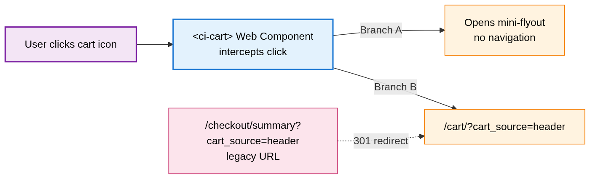

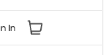

### Click behaviour

- When the user clicks the cart icon, the browser navigates to `/cart/?cart_source=header`.
- The legacy route `/checkout/summary?cart_source=header` 301-redirects to `/cart/`. Cart-href assertions should target the regex `/(cart|checkout)/`, not a literal path.
- `<ci-cart>` may intercept the click and open a flyout instead of navigating; the reliable observable contract is the `href` attribute, not the resulting navigation.

### Visual state

- The accessible name is `Cart` when the cart is empty.
- When the cart contains items, the accessible name includes a count, e.g. `Cart (3)`.
- A guest cart resets on browser session end; a logged-in cart is server-persisted across reloads and devices.

### Per-route presence

| Route                           | Cart icon visible? | Notes                                                                                |
| ------------------------------- | :----------------: | ------------------------------------------------------------------------------------ |
| Homepage `/`                    |         ✅         | Standard chrome                                                                      |
| Internal pages (product, blog…) |         ✅         | Standard chrome                                                                      |
| `/cart` and `/checkout/*`       |         ❌         | Suppressed via `<ci-header show-cart="false">`; rest of chrome (search, nav) remains |
| `/ndx/` (Design Lab)            |         ✅         | Same accessible name, same href                                                      |

`/cart` with an empty cart renders an `<h1>My Cart</h1>` page — it does **not** redirect to `/`.

### Testid anchor

- `data-testid="cart-global-header"` is exposed on the cart link inside the `<ci-cart>` shadow DOM. This is the second stable testid in the header (the first is `data-testid="my-account"` — see §6 Account menu).

### Caret affordance

- The caret adjacent to the cart icon carries `aria-haspopup="true"` but **no** `aria-expanded`. Combined with `<ci-cart>` pointer-event interception, the caret is effectively non-interactive for guests — clicks are swallowed.

### Known issues

- The empty-cart redirect behaviour described in earlier observations is stale; `/cart` no longer redirects.
- `<ci-cart>` pointer-event interception also blocks clicks on the adjacent Sign In caret button (`Open Sign In menu`) when the two elements overlap.

\newpage

## 5. Sign In

Guest-state identity affordance: a `Sign In` link in the right cluster of the header plus an adjacent caret button (`Open Sign In menu`). The Sign In flow is two-step: email at `/profiles/users/sign_in`, then password at `/profiles/users/sign_in_password`.

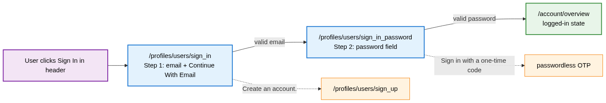

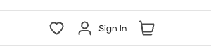

### Click behaviour

- Clicking the `Sign In` link navigates to `/profiles/users/sign_in` (step 1).
- Clicking the adjacent `Open Sign In menu` caret button is intercepted by the overlapping `<ci-cart>` shadow DOM; the caret is effectively non-interactive for guests.

### Step 1 — `/profiles/users/sign_in`

- Heading: `<h4>Sign In</h4>` (level 4, not level 1).
- Email field labelled `Enter Email Address`.
- Submit button: `Continue With Email`.
- Bottom link: `Create an account.` → `/profiles/users/sign_up`.
- **No Google or Facebook OAuth buttons.** Earlier observations listed `Continue With Google` and `Continue With Facebook`; those affordances are not in the current form.
- Submitting an empty form is blocked; the user stays on `/sign_in`.
- An invalid email format shows inline validation before any network call.

### Step 2 — `/profiles/users/sign_in_password`

- A password field renders after a valid email is submitted on step 1.
- Submitting valid credentials transitions to the logged-in state and lands on `/account/overview`.
- Side path: a `Sign in with a one-time code` link offers passwordless opt-in (sends a code to the email instead of using the password).

### Testid anchor

- `data-testid="my-account"` is present on the guest `Sign In` link, not only on the logged-in `My Account` link. The testid persists across auth states; only the label and href change. Distinguishing guest vs. logged-in requires checking the accessible name or href, not the testid alone.

### Per-route presence

- The Sign In link disappears in the logged-in state — see §6 Account menu.
- `/ndx/` (Design Lab) guest state: the Sign In affordance opens a **new browser tab** to `/profiles/users/sign_in` rather than navigating in-place (driven by the `use-popup-login=""` attribute on `<ci-header simple="true">`).

### Known issues

- The "passwordless flow" framing in earlier observations was wrong — step 1 alone has no password field, but step 2 does. The flow is two-step progressive, not passwordless.
- OAuth affordances may return in a future deployment; check the form before asserting their absence.

\newpage

## 6. Account menu

Logged-in identity surface in the right cluster of the header: a `My Account` link plus an adjacent caret button (`Open My Account menu`) that opens a 9-item dropdown.

### Dual affordance

- `<a data-testid="my-account" href="/account">My Account</a>` — direct link to the account overview.
- `<button aria-haspopup="true">Open My Account menu</button>` — opens the dropdown panel.

The two elements coexist. Clicking the link navigates; clicking the button opens the panel. Tests targeting the testid alone cannot distinguish guest (where the same testid is on the `Sign In` link) from logged-in.

### Dropdown items

Observed order, with destinations:

| #   | Item               | Destination                                                                  |
| --- | ------------------ | ---------------------------------------------------------------------------- |
| 1   | `My Designs`       | `/account/designs`                                                           |
| 2   | `My Uploads`       | `/account/arts` (path is "arts", not "uploads")                              |
| 3   | `Favorites`        | `/account/favorites` — carries a `New` badge (transient marketing copy)      |
| 4   | `Order History`    | `/account/orders`                                                            |
| 5   | `Group Orders`     | `/account/group_orders`                                                      |
| 6   | `Fundraising`      | `https://customink.com/fundraising/dashboard` (cross-subdomain absolute URL) |
| 7   | `Online Stores`    | `/account/stores`                                                            |
| 8   | `Account Settings` | `/account/settings`                                                          |
| 9   | `Sign Out`         | server logout endpoint at `/profiles/users/sign_out`                         |

`Sign Out` is separated from items 1–8 by a divider and preceded by an exit-door icon.

### Sign Out behaviour

- Clicking `Sign Out` posts to `/profiles/users/sign_out`, then redirects through one or more domains and lands back on `/profiles/users/sign_in`.
- Server cookies persist `is.authenticated=true` markers after sign-out; the presence of the `Sign In` link in the header is the reliable signal that the user is now in guest state, not the cookie value.

### Per-route presence

- Homepage and internal pages: the dual affordance renders when logged-in.
- `/cart` and `/checkout/*`: same shape, `<ci-header show-cart="false">` does not affect the identity surface.
- `/ndx/` (Design Lab) logged-in: dual affordance present. Items inside the dropdown panel are unverified beyond `My Designs` and `My Account` — opening the dropdown under Stencil hover semantics requires real mouse-hover and is blocked by `<ci-cart>` pointer interception under automation.

### Known issues

- The dropdown panel cannot be opened reliably under Playwright MCP (Stencil hover-only behaviour + `<ci-cart>` pointer-event interception). Real-mouse hover is required. Items 1–8 cross-validated against the `/account/overview` sidebar; item 9 (`Sign Out`) is sidebar-absent and was observed in earlier dropdown probes only.

\newpage

## 7. Favorites

Heart icon link in the right identity strip of the header.

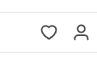

### State-aware behaviour

| State                                        | Visible? | href destination         | Empty-state copy on destination                                        |
| -------------------------------------------- | :------: | ------------------------ | ---------------------------------------------------------------------- |
| Guest                                        |    ✅    | `/products/favorites`    | `Browse our products and click the heart icon to save your favorites.` |
| Logged-in                                    |    ✅    | `/account/favorites`     | (account-scoped saved list; same copy when empty)                      |
| Any state on `/cart`, `/checkout/*`, `/ndx/` |    ❌    | n/a — heart not rendered | n/a                                                                    |

A state-spanning href assertion needs the regex `/\/(account|products)\/favorites/`.

### Accessibility detail

- The `<a>` carries both an accessible name `Favorites` (from the link text or `aria-labelledby`) and an `aria-label="Favorites"`. Strict-mode locators that match by role and by label may resolve to two matches on the same element; collapse with `.first()`.

### Known issues

- None tracked.

\newpage

## 8. Help affordances

Phone link and LiveChat widget in the header's utility strip ("Need Help? We've Got You").

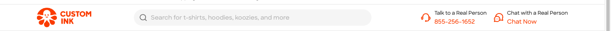

### Phone link

- The phone is a real `tel:` link in the utility strip; clicking it invokes the OS dialer.
- Format `\d{3}-\d{3}-\d{4}` is contractual. The specific number rotates per campaign and per surface.

Pool observed so far:

| Number         | Where seen                                                               |
| -------------- | ------------------------------------------------------------------------ |
| `855-271-2660` | Main header (homepage, internal pages, `/cart`, `/ndx/`) on 2026-05-21   |
| `855-256-1652` | Sign-in form footer on 2026-05-21; main header earlier in 2026-05-21     |
| `844-222-8343` | Main header on 2026-05-03; transient on a hat product page on 2026-05-21 |

Header and footer phone numbers can agree on some days and diverge on others — agreement is not a contract.

### Chat Now

- The chat trigger has the accessible name `Chat Now`. Activating it surfaces the LiveChat widget.
- The LiveChat iframe is **pre-mounted on every page load**, not injected on click. Iframe attributes: `title="LiveChat chat widget"`, `id="chat-widget"`, `src` rooted at `secure.livechatinc.com/customer/action/open_chat?license_id=6292471`.
- First click reveals the warm-mounted iframe; subsequent clicks toggle visibility.

### Per-route presence

- Homepage, internal pages, `/cart`, `/checkout/*`: phone and Chat Now visible in the utility strip.
- `/ndx/` (Design Lab): phone and Chat Now move into `ciHeader-subNav`, not the standard utility strip. The logged-in Lab adds a `Help` button alongside `Chat`.
- Mobile (≤ 375 px): the phone survives in the top strip; Chat Now is not in the header — it appears as a floating LiveChat widget anchored to the bottom-right and as a footer link.

### Known issues

- The `Chat Now` accessible name may rotate to `Live Chat` or `Get Help` under campaign overrides; the underlying iframe attributes are more stable.

\newpage

## 9. Promo strip

Conditional marketing strip rendered above the main header band. Drives traffic to active campaigns (sales, holiday promotions).

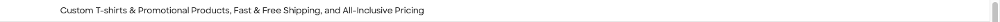

### Click behaviour

- When the strip renders, it shows a CTA link (e.g. `Shop Sale`). Clicking it navigates to a sale-tagged listing whose href usually matches `/sale/` or carries a `sale=true` query parameter.

### Rendering

- The strip is content-managed. Whether it renders on a given page load depends on the active campaign and session bucketing — there is no client-side toggle.
- The CTA copy rotates per campaign (`Shop Sale`, `Holiday Sale`, `Free Shipping`, etc.). Only the destination pattern is stable, not the label.
- Suppressed on `/cart`, `/checkout/*`, and `/ndx/` (Design Lab).
- Not observed at 375 px guest homepage on 2026-05-21; whether mobile suppresses it globally or per-session is unverified.

### Known issues

- Asserting absence of the strip is unreliable — when a campaign rolls out, the assertion breaks. Assert presence-and-href when the strip is expected; otherwise treat the strip as optional.

\newpage

## 10. Skip link

Accessibility affordance that lets keyboard and screen-reader users bypass the header chrome. Accessible name `Skip to main content`, href `#main-content`.

### Keyboard behaviour

- Pressing `Enter` on the focused skip link jumps focus past the header to `<main>` (or the equivalent landmark with id `main-content`).
- The skip link is the only header element that is invisible-by-default and becomes visible only on focus.

### Focus order regression

- The skip link is **not** the first `Tab` target on the homepage. On 2026-05-21, the first `Tab` from a fresh load focuses the LiveChat iframe; the skip link is reached at `Tab` #3.
- This breaks the WCAG 2.1 SC 2.4.1 (Bypass Blocks) intent: keyboard users have to traverse the LiveChat widget before they can skip the header.
- Investigate before relying on the skip link as a first-tab guarantee.

### Per-route presence

- Homepage, internal pages, `/cart`, `/checkout/*`, `/ndx/` (Design Lab), mobile: the skip link is present on every route.

### Known issues

- The LiveChat iframe capturing first focus is the active regression. Tracked as a WCAG 2.1 SC 2.4.1 candidate.

\newpage

## 11. Design Lab header

The header rendered on the Design Lab application surface at `/lab` (which redirects to `/ndx/`). The same `<ci-header>` element is mounted with different attributes.

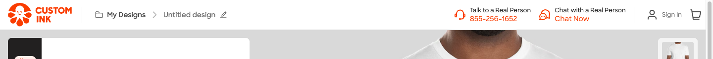

### Host element

- `<ci-header simple="true" cart-detail="" cart-pricing="" use-popup-login="">`
- `simple="true"` strips primary nav, search, mega-menus, and the standard utility strip.
- A `ciHeader-subNav` strip is added below the main band.

### Route and hash

- `/lab` 301-redirects to `/ndx/?EU=true&SK=<SKU>&PK=<PK>#/welcomeBack` (observed on anonymous guest with site cookies present).
- A `#/welcome` hash was hypothesised for first-time users in earlier observations, but the 2026-05-21 anonymous probe landed on `#/welcomeBack`. The welcome / welcomeBack split is cookie-driven, not deterministic by auth state.
- The `EU=true` query parameter is undocumented; origin (existing-user marker vs. European-locale marker) is unverified.
- Deeper hash routes exist for sub-flows, e.g. `#/next/saveForm` for the Save Design overlay.

### Top chrome — what renders

- Logo (same `customink logo - inky`, href `https://www.customink.com`).
- `My Designs` button — opens a saved-designs panel.
- `Untitled design` button — see "Design-name rename" below.
- Phone (`tel:` link, current value `855-271-2660`).
- Chat (`Chat Now` button, opens the LiveChat iframe).
- `Help` button — **logged-in only**; renders alongside `Chat` inside `ciHeader-subNav`.
- Cart icon (same href as global: `/cart/?cart_source=header`).
- Identity surface: `Sign In` for guests; `My Account` link + `Open My Account menu` button for logged-in users.

### Design-name rename

- The design-name affordance reads `Untitled design` by default. It is a `<button>` — not an `<input>` and not `role="textbox"`.
- Clicking the button transitions the hash to `#/next/saveForm`, which opens a `Save Design` modal overlay on top of the design surface. The modal collects a Design Name, an Email, and a Privacy Policy consent checkbox, then submits to save the work-in-progress.
- The simplified header stays visible while the modal is open.

### Sign In as a popup

- `use-popup-login=""` on the host attribute name suggests an in-page overlay, but in practice clicking `Sign In` opens a **new browser tab** to `/profiles/users/sign_in`. Same-tab navigation is not observed.

### What lives outside the header

- The workflow buttons (`Save`, `Next`, `Get Price`, `Back`) live in a bottom action bar attached to the design canvas, not in the header. Locators scoped to the header subtree will not find them.

### Per-state behaviour

- Guest: `Sign In` link and `Open Sign In menu` caret in the right cluster. No `Help` button in `ciHeader-subNav`.
- Logged-in: `My Account` link + `Open My Account menu` button replace the Sign In affordance. `Help` button appears alongside `Chat`. The cookie `profiles-spa-client.*is.authenticated=true` drives the swap — note that the homepage `<ci-header-prerender>` does not read this cookie, so the same session can appear logged-in on `/ndx/` while still anonymous on `/`.

### Known issues

- Account-menu dropdown items in Lab logged-in state are unverified beyond the top of the panel; Stencil hover semantics and `<ci-cart>` pointer interception block automated opening.
- The design-name button label switch (from `Untitled design` to the actual design name once a design has been saved) is unverified.
- `#/welcome` vs `#/welcomeBack` heuristic is cookie-driven and not deterministic from URL alone.
