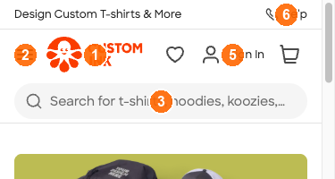
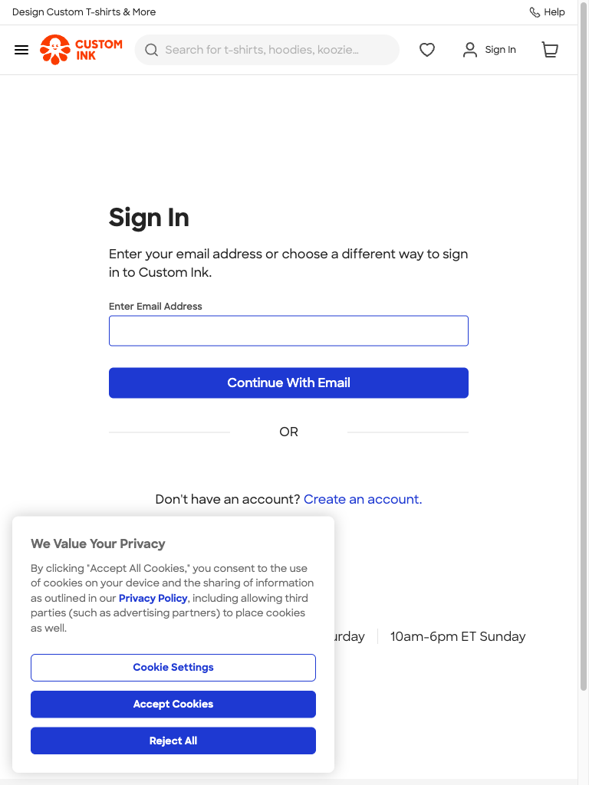
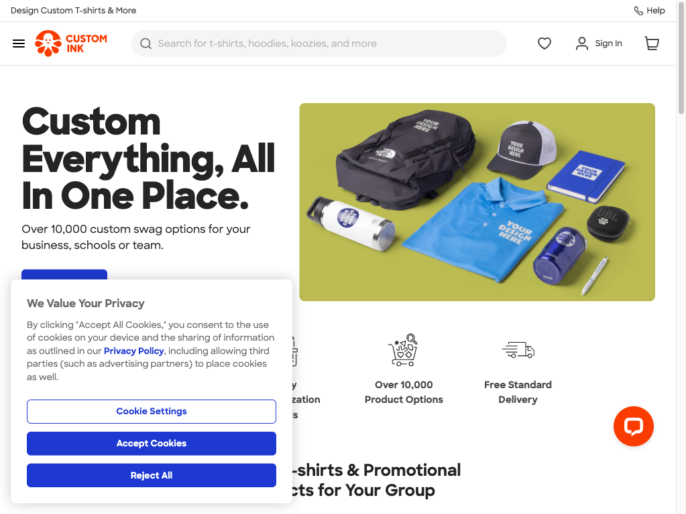
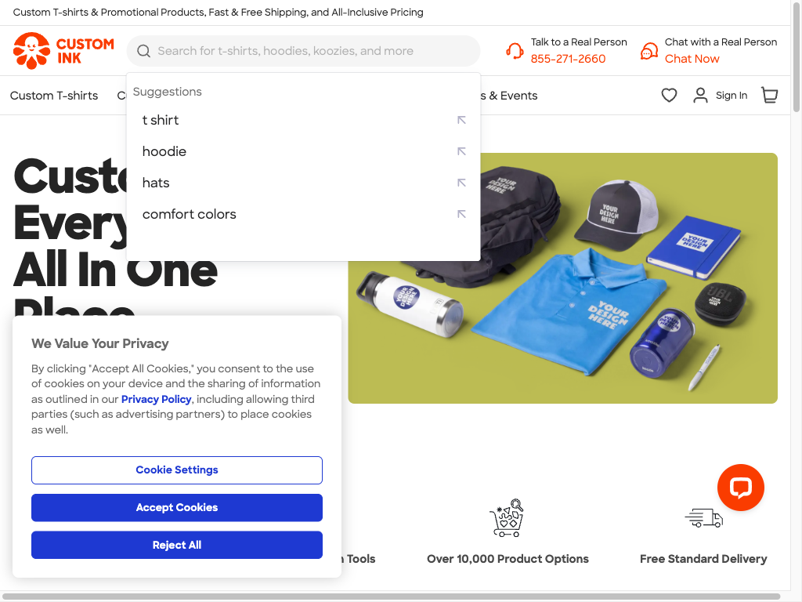
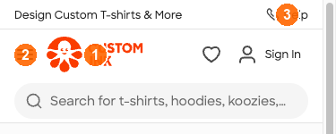
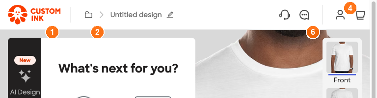

# Technická dokumentácia hlavičky customink.com

Funkčná aj behaviorálna špecifikácia všetkých variantov hlavičky stránky [customink.com](https://www.customink.com).

|                        |                                    |
| ---------------------- | ---------------------------------- |
| **Riešiteľ**           | Roman Kováč                        |
| **Dátum spracovania**  | 2026-05-25                         |
| **Verzia dokumentu**   | 1.0                                |
| **Pozorovania zo dní** | 2026-05-03, 2026-05-21, 2026-05-25 |

## Identifikované varianty

Na stránke sa vyskytujú štyri varianty hlavičky:

| #   | Variant                                       | Trigger / podmienky výskytu                                             |
| --- | --------------------------------------------- | ----------------------------------------------------------------------- |
| 1   | **Homepage header — neprihlásený používateľ** | Verejné marketingové a katalógové stránky, používateľ NIE je prihlásený |
| 2   | **Cart / Checkout header**                    | URL `/cart`, `/checkout/*` (akýkoľvek user state)                       |
| 3   | **Design Lab header**                         | URL `/lab` → redirect na `/ndx/*` (akýkoľvek user state)                |
| 4   | **Accounts header — prihlásený používateľ**   | Akákoľvek stránka mimo `/cart` a `/lab`, používateľ prihlásený          |

Každý variant je spracovaný podľa kapitoly 4 zadania (7 sekcií X.1 — X.7). Číslovanie prvkov vo funkčnej špecifikácii zodpovedá číslam na priložených screenshotoch.

---

# Spoločné technické základy

Táto kapitola sumarizuje to, čo platí pre všetky štyri varianty hlavičky.

## Technický stack

| Vrstva                     | Použité                                                                                                                                                                                                                               |
| -------------------------- | ------------------------------------------------------------------------------------------------------------------------------------------------------------------------------------------------------------------------------------- |
| **Component model**        | [Stencil.js](https://stenciljs.com/) Web Components. Všetky hlavičkové komponenty sú custom elementy s prefixom `<ci-…>`.                                                                                                             |
| **Hlavné custom elementy** | `<ci-header-prerender>` (SSR shell na homepage), `<ci-header>` (klientsky hydratovaná hlavička), `<ci-cart>` (cart icon + flyout, shadow DOM), `<ci-mobile-subnav>` (mobile drawer), `<ci-punchout-banner>` (B2B punchout container). |
| **Search**                 | [Algolia DocSearch](https://www.algolia.com/) — autocomplete listbox `.aa-Panel`, form wrapper `.aa-Form`, result items `.aa-Item`.                                                                                                   |
| **Chat**                   | [LiveChat](https://www.livechatinc.com/) (vendor iframe z `secure.livechatinc.com`). Warm-mounted, viditeľnosť riadi vendor JS.                                                                                                       |
| **Auth backend**           | `profiles-spa-client` (custom CustomInk SPA). Sign-in routes pod `/profiles/users/*`.                                                                                                                                                 |
| **A/B testing**            | [Optimizely](https://www.optimizely.com/) — server-rendered copy variants. Bucket info v `dataLayer.ab_test_*`.                                                                                                                       |
| **Verzionovanie balíkov**  | `unverified` — repo / package.json prístup nebol súčasťou probe scope. Pred implementáciou vyžiadať od front-end tímu.                                                                                                                |

## HTML semantic landmark štruktúra

Očakávaná outer štruktúra dokumentu (každý variant ju zachováva, líši sa len obsah `<ci-header>`):

```html
<body>
  <!-- A11y skip link, viditeľný len na :focus, viď §1.3 Prvok 15 -->
  <a class="skip-link" href="#main-content">Skip to main content</a>

  <!-- header landmark – wrapper okolo Stencil komponentov -->
  <header role="banner">
    <ci-header-prerender>
      <ci-header>
        <!-- utility strip – sekundárna navigácia -->
        <nav aria-label="utility">…</nav>
        <!-- primary nav + identity strip -->
        <nav aria-label="primary">…</nav>
      </ci-header>
    </ci-header-prerender>
    <!-- B2B punchout container – default empty, populated v punchout session -->
    <ci-punchout-banner></ci-punchout-banner>
  </header>

  <main id="main-content">…</main>
</body>
```

**Pozorovania:**

- `role="banner"` na `<header>` je explicitný (nie odvodený z tagu samotného) — Stencil host element neslúži ako landmark, treba ho obaliť.
- Skip link musí byť **pred** `<header>` v DOM-e, aby Tab #1 dosiahol jeho target. Aktuálne live je porušené (viď §1.7 bod 1).
- `<main id="main-content">` je povinný anchor pre skip link.
- `<nav aria-label>` rozlišuje utility vs primary navigation pre screen-reader.

## Dizajnové tokeny

Hodnoty extrahované zo `getComputedStyle()` cez Chromium DevTools (probe sessions 2026-05-03, 2026-05-21, 2026-05-25). Tokeny mimo zoznam treba doplniť z repo (CSS variables alebo design-token JSON).

| Kategória         | Token                | Hodnota                          | Použitie                                                               |
| ----------------- | -------------------- | -------------------------------- | ---------------------------------------------------------------------- |
| **Primary**       | `--ci-blue-primary`  | `#1e39d2`                        | Skip link bg, focus outline, hover text, search `:focus-within` border |
| **Hover bg**      | `--ci-blue-hover-bg` | `rgba(30, 57, 210, 0.08)`        | Identity strip hover (`.accounts:hover`)                               |
| **Skip link fg**  | n/a (literal)        | `#ffffff`                        | Skip link text                                                         |
| **Focus outline** | n/a (literal)        | `2px solid #1e39d2; -2px offset` | `:focus` na linkoch, tlačidlách v identity strip                       |
| **Text default**  | `unverified`         | `unverified`                     | Body text v hlavičke                                                   |
| **Text muted**    | `unverified`         | `unverified`                     | Sekundárny text (phone number, utility)                                |
| **Border**        | `unverified`         | `unverified`                     | Bottom rule pod hlavičkou                                              |

**Typografia:**

- Skip link: `font-size: 14px; font-weight: 600` (jediný verifikovaný spec z probe).
- Telesný font, font-family, sizes pre H1 / utility links / search placeholder: `unverified` — vyžaduje extrakciu z `getComputedStyle()` na ostatných prvkoch alebo z design-token zdroja.

**Spacing & layout:**

- Skip link padding: `8px 16px`, border-radius: `6px`.
- Identity strip hover padding: `0 8px`, border-radius: `8px`.
- Search Algolia panel transition: `opacity 200ms ease-in, filter 200ms ease-in`; item hover: `150ms`; reduced-motion vypína transitions.
- Header CSS deklaruje **jediný** explicitný `transition`: `.overlay { transition: all 0.15s ease-out }`. Všetky ostatné animácie sú JS-driven (Stencil).

## Service & API závislosti

| Služba              | Endpoint / origin                              | Použitie                                                                                              | Failure mode `unverified` ak nie je uvedené                                          |
| ------------------- | ---------------------------------------------- | ----------------------------------------------------------------------------------------------------- | ------------------------------------------------------------------------------------ |
| **Algolia search**  | App ID / index name — `unverified`             | Autocomplete listbox po napísaní ≥ 2 znakov                                                           | Pri error/timeout: `unverified` (predpoklad: panel sa neotvorí, žiadny fallback UI). |
| **Cart service**    | `/cart/*`, `/checkout/*` REST `unverified`     | Cart count → `<ci-cart>` badge. State propagation `unverified` (event bus vs polling vs SSE).         | Pri error: cart icon zostáva visible, badge `unverified`.                            |
| **LiveChat iframe** | `secure.livechatinc.com`                       | Chat widget. Warm-mount aj keď user nekliká.                                                          | Pri vendor outage: Chat Now CTA visible ale neaktívna. Click `unverified`.           |
| **Profiles SPA**    | `/profiles/users/sign_in`, `/sign_in_password` | Auth flow. Cookie `profiles-spa-client.*.is.authenticated` signalizuje stav.                          | Pri 401/500: redirect / inline error `unverified`.                                   |
| **Optimizely**      | Vendor SaaS (server-side bucketing)            | Hlavičkový copy A/B (napr. `feature_ships_24_hours_test_v2`). Server-rendered, žiadny client request. | Pri outage: server fallback na default copy.                                         |

## Cookies čítané hlavičkou (konsolidovaný zoznam)

| Cookie                                        | Účel                             | Dôsledok pre hlavičku                                                                                                                                                                                                                    |
| --------------------------------------------- | -------------------------------- | ---------------------------------------------------------------------------------------------------------------------------------------------------------------------------------------------------------------------------------------- |
| `profiles-spa-client.*.is.authenticated`      | Auth state (guest vs logged-in)  | Riadi swap variant 1 ↔ variant 4. **Pozor:** `<ci-header-prerender>` (homepage) cookie NECHíta — môže vzniknúť variant 4 v Labe + variant 1 na `/` v rovnakom okamihu (viď §4.7 bod 4). `<ci-header>` (internal pages, Lab) cookie číta. |
| `feature_ships_24_hours_test_v2` (Optimizely) | A/B bucket pre hlavičkový copy   | Bucket `excluded` → default copy. `dataLayer.ab_test_name = "2026 04 01 Ships 24 Hours"`, `ab_test_location = "header"`.                                                                                                                 |
| `page_tests`, `session_token`, `__kla_*`      | Personalizačné / session cookies | Môžu spôsobiť aggressive redirect na `/lab` (Design Lab) pre returning visitors.                                                                                                                                                         |
| `interactions`                                | Returning-visitor signal         | Aktivuje aggressive Lab redirect. Testy musia začať z čistého cookie state, inak landne v Labe namiesto homepage.                                                                                                                        |
| `feature_*` (16 aktívnych)                    | Feature flags                    | Nie všetky majú UI dopad na hlavičku, ale sú kanonickým hookom pre nové surfaces. Cookie names viditeľné v probe session — konkrétne flag mapping `unverified`.                                                                          |

## Performance & loading hints

- `<ci-header-prerender>` server-rendered → first paint hlavičky pred Stencil hydratáciou. Reserved `min-height: 138px` zabraňuje CLS pri hydrate.
- Hydratácia `<ci-header>` je defer-loaded (vidno `class="hydrated"` po dokončení). Konkrétny timing / bundle size: `unverified`.
- LiveChat iframe je warm-mounted (vendor JS rozhoduje o display). Nezávisí na user-intent click.
- Algolia search je on-demand: žiadny request kým user nezačne písať (2+ znaky).

---

# Variant 1: Homepage header — neprihlásený používateľ




## 1.1 Identifikácia variantu

|                                    |                                                                                                                                                                                                                                                  |
| ---------------------------------- | ------------------------------------------------------------------------------------------------------------------------------------------------------------------------------------------------------------------------------------------------ |
| **Názov variantu**                 | Homepage header — neprihlásený používateľ                                                                                                                                                                                                        |
| **Výskyt**                         | `/` (homepage), `/products/*`, `/blog/*`, `/about`, `/inspiration`, `/contact`, `/help_center`, `/sign_in`, `/sign_up` a všetky ostatné verejné stránky mimo `/cart`, `/checkout/*` a `/lab`                                                     |
| **Podmienky výskytu**              | Používateľ NIE je prihlásený (auth cookie `profiles-spa-client.*.is.authenticated` chýba alebo je `false`)                                                                                                                                       |
| **Host element**                   | `<ci-header-prerender>` na `/` (server-prerendered SSR shell pre rýchly first paint, vždy prítomný); `<ci-header>` sa hydratuje sa cez Stencil.js klientsky framework                                                                            |
| **Screenshot — desktop ≥ 1440 px** | Príloha č. 1 — `header-annotated.png` (čísla 1-16 zodpovedajú stĺpcu **#** v tabuľke 1.2)                                                                                                                                                        |
| **Screenshot — mobile ≤ 480 px**   | Príloha č. 2 — `mobile-1-homepage.png`                                                                                                                                                                                                           |
| **Výška hlavičky — desktop**       | 138 px reservovaná cez `ci-header-prerender { min-height: 138px }` (utility strip 33 px + main band 65 px + announcement banner 0-40 px). Z toho ~98 px observable v aktívnom rendering, zvyšok je reservovaný pre prípadný announcement banner. |
| **Výška hlavičky — mobile**        | ~100 px (utility strip + main band; primary nav je presunutý mimo `<header>` do `<main>` ako flat link list)                                                                                                                                     |
| **Z-index**                        | `<ci-header-prerender>` = 300, `.main-container` = 301, vnútorný `.ciHeader` = 100, skip link = 1000, search dropdown (`.aa-Panel`) = 99999                                                                                                      |
| **Sticky správanie**               | Hlavička **NIE je sticky.** Computed `position: relative` pri každom scroll Y. Žiadny `position: fixed`, žiadny `position: sticky`. Pri scrolle sa posúva nahor a opúšťa viewport. Žiadny box-shadow ani CSS class transition pri scrolle.       |

## 1.2 Funkčná špecifikácia

Prvky hlavičky v poradí zľava doprava (zhora nadol pre utility strip a primary nav):

| #   | Prvok                                          | Typ                                    | Akcia pri kliknutí                                                      | Cieľ / destination                                      | Viditeľnosť                                       |
| --- | ---------------------------------------------- | -------------------------------------- | ----------------------------------------------------------------------- | ------------------------------------------------------- | ------------------------------------------------- |
| 1   | Logo (CustomInk wordmark)                      | `link`                                 | Navigácia na homepage                                                   | `https://www.customink.com/` (absolute)                 | Vždy                                              |
| 2   | Search field (autocomplete)                    | `combobox` obsahujúci `searchbox`      | Otvára autocomplete listbox po ≥ 2 znakoch                              | Search results URL (Algolia)                            | Vždy desktop; za icon-button button na mobile     |
| 3   | Mega-menu trigger "Custom T-shirts"            | `link` + susedný caret `button`        | Hover otvára panel F1 (10 položiek); klik na link naviguje na kategóriu | `/products/t-shirts/4` (link) / F1 (caret)              | Len desktop ≥ 1024 px                             |
| 4   | Mega-menu trigger "Custom Apparel"             | `link` + susedný caret `button`        | Hover otvára panel F2 (16 položiek)                                     | `/products/apparel/857` / F2                            | Len desktop ≥ 1024 px                             |
| 5   | Mega-menu trigger "Promotional Products"       | `link` + susedný caret `button`        | Hover otvára panel F3 (20 položiek)                                     | `/products/promotional-products/218` / F3               | Len desktop ≥ 1024 px                             |
| 6   | Mega-menu trigger "Design Lab"                 | `link` + susedný caret `button`        | Hover otvára panel F4 (marketing card, 2 CTA)                           | `/lab` / F4                                             | Len desktop ≥ 1024 px                             |
| 7   | Mega-menu trigger "Groups & Events"            | `button`-only (bez link companion)     | Hover otvára panel F5 (3 sekcie, 14 položiek)                           | n/a (panel-only) / F5                                   | Len desktop ≥ 1024 px                             |
| 8   | Phone link (utility strip)                     | `link href^="tel:"`                    | Aktivuje OS dialer cez `tel:` schemu                                    | `tel:<aktuálne číslo>` (číslo rotuje, viď 1.6)          | Vždy                                              |
| 9   | Chat Now (utility strip)                       | `button` / `link`                      | Otvorí (warm-mounted) LiveChat iframe                                   | LiveChat (`secure.livechatinc.com`, license_id=6292471) | Vždy desktop; mimo header na mobile               |
| 10  | Favorites heart                                | `link`                                 | Navigácia na guest empty-state Favorites                                | `/products/favorites`                                   | Vždy (aj guest, v identity strip)                 |
| 11  | Sign In link (`data-testid="my-account"`)      | `link`                                 | Navigácia na sign-in step 1                                             | `/profiles/users/sign_in`                               | Len neprihlásený                                  |
| 12  | Open Sign In menu (caret)                      | `button` `aria-haspopup="true"`        | Otvára Sign In dropdown D1                                              | D1                                                      | Len neprihlásený                                  |
| 13  | Cart icon (`data-testid="cart-global-header"`) | `link` (v `<ci-cart>` shadow DOM)      | Navigácia na cart route alebo intercept → flyout                        | `/cart/?cart_source=header`                             | Vždy                                              |
| 14  | Promo CTA "Shop Sale" (promo strip)            | `link`                                 | Navigácia na sale listing                                               | `/sale/...` (href s `/sale/` slug-om)                   | Conditional (kampaňou riadené)                    |
| 15  | Skip link "Skip to main content"               | `link`                                 | Presúva fokus za hlavičku na landmark                                   | `#main-content`                                         | Visible only on Tab focus                         |
| 16  | `#menuButton` (hamburger)                      | `button` (`.ciHeader-mobile-menu-btn`) | Otvára mobile off-canvas menu / drawer                                  | Mobile drawer (`<ci-mobile-subnav>`)                    | Len mobile ≤ 1023 px, `display: flex`, 40 × 40 px |

**Stabilné selectory per prvok (Playwright odporúčania):**

| #   | Prvok                    | Odporúčaný selector                                                                                                                                |
| --- | ------------------------ | -------------------------------------------------------------------------------------------------------------------------------------------------- |
| 1   | Logo                     | `page.getByRole('link', { name: /customink logo/i })` (accessible name má sub-string "- inky" mascot — exact match zlyhá, použiť tolerantný regex) |
| 2   | Search field             | `page.getByRole('searchbox')` alebo `page.getByPlaceholder(/search/i)`                                                                             |
| 3-7 | Mega-menu caret tlačidlá | `page.getByRole('button', { name: /Open .* menu/i })` (`aria-label="Open <Name> menu"`)                                                            |
| 3   | "Custom T-shirts"        | `page.getByRole('button', { name: 'Open Custom T-Shirts menu' })`                                                                                  |
| 4   | "Custom Apparel"         | `page.getByRole('button', { name: 'Open Custom Apparel menu' })`                                                                                   |
| 5   | "Promotional Products"   | `page.getByRole('button', { name: 'Open Promotional Products menu' })`                                                                             |
| 6   | "Design Lab"             | `page.getByRole('button', { name: 'Open Design Lab menu' })`                                                                                       |
| 7   | "Groups & Events"        | `page.getByRole('button', { name: 'Open Groups & Events menu' })`                                                                                  |
| 8   | Phone link               | `page.getByRole('link', { name: /Call /i })` (`aria-label="Call 1-800-…"`)                                                                         |
| 9   | Chat Now                 | `page.getByRole('button', { name: /chat now/i })` (LiveChat iframe; selector nemusí byť stable cez vendor update)                                  |
| 10  | Favorites heart          | `page.getByRole('link', { name: 'Favorites' })` (`aria-label="Favorites"`)                                                                         |
| 11  | Sign In link             | `page.getByTestId('my-account').filter({ hasText: 'Sign In' })` — testid je shared so logged-in stateom, treba filter cez text alebo `href`        |
| 12  | Open Sign In menu caret  | `page.getByRole('button', { name: /Open Sign In menu/i })` — **automatizácia ho swallowed cez `<ci-cart>` shadow DOM intercept; treba real-mouse** |
| 13  | Cart icon                | `page.getByTestId('cart-global-header')` (nachádza sa vnútri `<ci-cart>` shadow DOM)                                                               |
| 14  | Promo CTA "Shop Sale"    | `page.getByRole('link', { name: /shop sale/i })` (text-based, môže sa meniť seasonally)                                                            |
| 15  | Skip link                | `page.getByRole('link', { name: /skip to main content/i })` (visible only on Tab focus — `page.keyboard.press('Tab')` pred assertion)              |
| 16  | Hamburger                | `page.locator('#menuButton')` alebo `page.getByRole('button', { name: /menu/i })` (len mobile ≤ 1023 px, kontrolovať `viewport.width`)             |

**Notes:**

- DOM má duplicate cart/favorites instances (mobile + desktop slot, jeden visible podľa breakpointu) — scope cez `:visible` filter alebo `viewport.width < 1024` switching, NIE cez tag samotný.
- Pre auth-state diferenciáciu (variant 1 vs variant 4) sa `data-testid="my-account"` recykluje — pair s `aria-label` alebo `href` (`/profiles/users/sign_in` vs `/account`).

## 1.3 Behaviorálna špecifikácia

Detailné správanie pre každý interaktívny prvok. Pole **Animácia/timing** je vyplnené tam, kde sú CSS dáta verifikované cez `getComputedStyle`. Inde je pole označené `unverified` (väčšina prvkov — header CSS deklaruje **jediný** explicitný transition: `.overlay { transition: all 0.15s ease-out }`. Všetky ostatné mega-menu, cart-flyout a mobile-drawer animácie sú JS-driven a nie sú merateľné z CSS).

### Prvok 1 — Logo

|                     |                                                                                                                                                                                                |
| ------------------- | ---------------------------------------------------------------------------------------------------------------------------------------------------------------------------------------------- |
| **Trigger**         | Hover (desktop), Click, Cmd/Ctrl-Click, Focus (Tab)                                                                                                                                            |
| **Akcia**           | Hover: žiadny CSS state change. Click: navigácia na `/`. Cmd/Ctrl-Click: otvorí `/` v novej tabe (aktuálna routa zostáva). Focus: browser-default focus ring (žiadny custom outline declared). |
| **Podmienky**       | Funguje na všetkých routách. Pri návrate z internal page na `/` sa host element re-mountuje z `<ci-header>` na `<ci-header-prerender>`.                                                        |
| **Zatvorenie**      | n/a (jednorazová akcia)                                                                                                                                                                        |
| **Animácia/timing** | `transition: all 0s ease 0s` (computed). Logo NEMÁ žiadnu CSS-driven hover transition; color `rgb(30,57,210)` zostáva stabilná.                                                                |

**Accessible name:** `customink logo - inky` (mascot tag "- inky" je súčasťou `aria-label`).

### Prvok 2 — Search field

|                         |                                                                                                                                                                                                                                                                                                                                                                                                                                                                                          |
| ----------------------- | ---------------------------------------------------------------------------------------------------------------------------------------------------------------------------------------------------------------------------------------------------------------------------------------------------------------------------------------------------------------------------------------------------------------------------------------------------------------------------------------- |
| **Trigger**             | Focus (klik alebo Tab), Typing, ArrowDown / ArrowUp, Enter, Escape                                                                                                                                                                                                                                                                                                                                                                                                                       |
| **Akcia**               | Focus: kurzor v inpute, placeholder skrytý. Typing ≥ 2 znakov: Algolia request, dropdown `.aa-Panel` sa zobrazí pod inputom. ArrowDown / Up: highlight suggestion. Enter (s výberom): navigácia na suggestion destination. Enter (bez výberu): navigácia na search results s queryom. Escape: dropdown **odmontuje sa z DOM-u** (nielen skryje), input hodnotu zachová.                                                                                                                  |
| **Podmienky**           | Funguje len keď je search prítomný — tj. NIE na `/lab` (`simple="true"` strips ho) a NIE na mobile pred kliknutím na search-icon button (na mobile sa overlay je `.aa-DetachedContainer` full-screen).                                                                                                                                                                                                                                                                                   |
| **Zatvorenie listboxu** | Escape; click mimo; blur z search inputu; výber suggestion                                                                                                                                                                                                                                                                                                                                                                                                                               |
| **Animácia/timing**     | Algolia dropdown `.aa-Panel`: `transition: opacity 200ms ease-in, filter 200ms ease-in`. Hover na result item `.aa-Item`: `transition-duration: 150ms`. Pri `prefers-reduced-motion`: transition vypnutý. Pri `:focus` na input: `outline: 3px [none] rgba(0,0,0,0.86); outline-offset: -2px` (poznámka: `outline-style: none` v computed style — focus ring nemusí byť viditeľný v niektorých Chromium buildoch). Form wrapper `.aa-Form:focus-within`: `border-color: rgb(30,57,210)`. |

**Edge cases:**

- Empty submit (`Enter` na prázdnom inpute): žiadna navigácia, URL zostáva.
- Whitespace-only input: rovnaké ako empty submit.
- Oversized input (> 500 znakov): input field truncate alebo accept, žiadny crash.
- Query bez Algolia hits (napr. `qpzwxqp`): naviguje na results page s explicit "no results" copy, NIE silent fallback na `/`.

### Prvky 3-7 — Mega-menu triggers

|                     |                                                                                                                                                                                                                                                                                                                                                                         |
| ------------------- | ----------------------------------------------------------------------------------------------------------------------------------------------------------------------------------------------------------------------------------------------------------------------------------------------------------------------------------------------------------------------- |
| **Trigger**         | Hover (desktop), Click (desktop), Focus + Enter/Space (keyboard)                                                                                                                                                                                                                                                                                                        |
| **Akcia**           | Hover na link alebo caret: panel sa otvorí, caret `aria-expanded="true"`. Caret click je intercepted by adjacent `<a>` (link element zachytáva pointer events) — efektívne hover na link sa správa rovnako. **Groups & Events** je výnimka: button-only, žiadny link companion.                                                                                         |
| **Podmienky**       | Len desktop ≥ 1024 px (hard breakpoint, viď 1.5). Mobile ≤ 1023 px: `<ci-navigation>` má `display: none`, mega-menus disabled; položky migrate do mobile drawer.                                                                                                                                                                                                        |
| **Zatvorenie**      | Hover-out z trigger aj panel; Escape (s fokus na trigger) zavrie panel a vráti fokus na trigger; hover iný trigger zavrie aktuálny a otvorí nový (no panel-stacking)                                                                                                                                                                                                    |
| **Animácia/timing** | **Mega-menu panel animation: nie je deklarovaná v CSS.** Žiadne `@keyframes`, žiadny `transition` rule pre mega-menu element bol nájdený v scoped stylesheets `sc-ci-header-prerender` ani `sc-ci-header`. Otváracia animácia je JS-driven (Stencil component) — pravdepodobne `opacity` / `display` toggle. Hover-intent delay a close-delay nie sú deklarované v CSS. |

Detail panelov: viď 1.4 (F1-F5).

### Prvok 8 — Phone link

|                     |                                                                                                                                                                                         |
| ------------------- | --------------------------------------------------------------------------------------------------------------------------------------------------------------------------------------- |
| **Trigger**         | Click (desktop), Tap (mobile)                                                                                                                                                           |
| **Akcia**           | Aktivuje OS dialer cez `tel:` href. Klik neopustí stránku v rámci browser session.                                                                                                      |
| **Podmienky**       | Vždy prítomný v utility stripe. Mobile: `.banner-ttarpMobile` button (40 × 32 px), v `.banner-container` row. Mobile button `display: flex` na ≤ 1023 px, `display: none` na ≥ 1024 px. |
| **Zatvorenie**      | n/a (OS dialer dialog)                                                                                                                                                                  |
| **Animácia/timing** | `unverified` — žiadny `transition` rule deklarovaný pre phone link, žiadna pozorovaná hover animácia. Color a typography sú stabilné.                                                   |

**Pool aktuálnych čísel** (rotujú per campaign / per surface, **content-managed** Operations tímom):

- `855-271-2660` (main header, pozorované 2026-05-21 a 2026-05-25)
- `855-256-1652` (main header earlier 2026-05-21; sign-in form footer)
- `844-222-8343` (main header 2026-05-03; transient na hat product page 2026-05-21)

Format všetkých čísel: `\d{3}-\d{3}-\d{4}`. **Konkrétne číslo neassertovať** — assertovať len format.

### Prvok 9 — Chat Now

|                     |                                                                                                                                                                                                                          |
| ------------------- | ------------------------------------------------------------------------------------------------------------------------------------------------------------------------------------------------------------------------ |
| **Trigger**         | Click                                                                                                                                                                                                                    |
| **Akcia**           | Odhalí LiveChat iframe. Iframe je **pre-mounted on every page load** (warm) — prvý klik len odhalí, nečaká na load.                                                                                                      |
| **Podmienky**       | Desktop: prítomný v utility stripe. **Mobile (≤ 1023 px): mimo `<header>` ako floating widget v bottom-right rohu** (LivePerson script injects `<span id="LP_*">` elementy s `aria-label="Chat Now"` mimo header DOM).   |
| **Zatvorenie**      | Štandardný LiveChat close button v iframe (out-of-scope pre header)                                                                                                                                                      |
| **Animácia/timing** | LiveChat vendor-controlled; reveal animation `unverified`. Iframe attributes: `title="LiveChat chat widget"`, `id="chat-widget"`, `src` z `https://secure.livechatinc.com/customer/action/open_chat?license_id=6292471`. |

### Prvok 10 — Favorites heart

|                     |                                                                                                                                  |
| ------------------- | -------------------------------------------------------------------------------------------------------------------------------- |
| **Trigger**         | Click (desktop), Tap (mobile)                                                                                                    |
| **Akcia**           | Navigácia na `/products/favorites` (guest empty-state route). Logged-in variant smeruje na `/account/favorites` — viď Variant 4. |
| **Podmienky**       | **Heart je viditeľný v guest state v identity strip** (pravá strana main band). Skrytý na `/cart`, `/checkout/*`, `/lab`.        |
| **Zatvorenie**      | n/a                                                                                                                              |
| **Animácia/timing** | `unverified` — žiadny `transition` rule deklarovaný. Žiadna CSS hover animation.                                                 |

**Accessibility detail:** `<a>` nesie zároveň accessible name "Favorites" (z text content / aria-labelledby) AJ `aria-label="Favorites"` — strict-mode role+label locators rezolvujú na dva matches na rovnaký element. Riešenie: `.first()` na locator.

### Prvok 11 — Sign In link

|                     |                                                                                                                                                                                                                                                               |
| ------------------- | ------------------------------------------------------------------------------------------------------------------------------------------------------------------------------------------------------------------------------------------------------------- |
| **Trigger**         | Click, Enter (s fokus)                                                                                                                                                                                                                                        |
| **Akcia**           | Navigácia na `/profiles/users/sign_in` (sign-in step 1 — email-only formular).                                                                                                                                                                                |
| **Podmienky**       | Len guest. Po prihlásení sa Sign In link nahradí My Account linkom (variant 4).                                                                                                                                                                               |
| **Zatvorenie**      | n/a                                                                                                                                                                                                                                                           |
| **Animácia/timing** | `:hover` na `.accounts` parent: `color: #1e39d2; background: rgba(30,57,210,0.08)`. **Hodnota okamžitá** — `transition: all 0s ease 0s` (žiadna duration). Padding `0 8px`, border-radius `8px`. `:focus` outline: `2px solid #1e39d2; outline-offset: -2px`. |

**Test-id anchor:** `data-testid="my-account"` (persists across auth states — v guest na Sign In, v logged-in na My Account). Distinguish auth state cez accessible name (`Sign In` vs `My Account`) alebo href.

### Prvok 12 — Open Sign In menu caret button

|                     |                                                                                                                                                                                                                                |
| ------------------- | ------------------------------------------------------------------------------------------------------------------------------------------------------------------------------------------------------------------------------ |
| **Trigger**         | Click                                                                                                                                                                                                                          |
| **Akcia**           | Otvorí Sign In dropdown D1 (viď 1.4).                                                                                                                                                                                          |
| **Podmienky**       | Len guest. Caret je adjacent k Sign In linku. **Pozorovanie:** Caret je čiastočne intercepted by `<ci-cart>` shadow DOM v overlapping zone — synthetic pointer events (Playwright MCP) sú swallowed; real-mouse click funguje. |
| **Zatvorenie**      | Click mimo panel; Escape (s fokus na panel)                                                                                                                                                                                    |
| **Animácia/timing** | `:focus` outline: `2px solid #1e39d2; outline-offset: -2px`. Open animation panelu: `unverified` (JS-driven).                                                                                                                  |

### Prvok 13 — Cart icon

|                     |                                                                                                                                                                                                                                                                                                                        |
| ------------------- | ---------------------------------------------------------------------------------------------------------------------------------------------------------------------------------------------------------------------------------------------------------------------------------------------------------------------- |
| **Trigger**         | Click                                                                                                                                                                                                                                                                                                                  |
| **Akcia**           | `<ci-cart>` Web Component intercepts click. Build-dependent behaviour: (A) otvorí mini-cart flyout panel bez navigation, (B) naviguje na cart route. Pozorovanie 2026-05-21: navigation. Cart link href: `/cart/?cart_source=header`. Legacy route `/checkout/summary?cart_source=header` 301-redirektuje na `/cart/`. |
| **Podmienky**       | Vždy viditeľný na ne-cart routách. Na `/cart` / `/checkout/*`: icon suppressed cez atribút `<ci-header show-cart="false">`.                                                                                                                                                                                            |
| **Zatvorenie**      | n/a                                                                                                                                                                                                                                                                                                                    |
| **Animácia/timing** | Cart icon `transition: all 0s ease 0s` (žiadna). Flyout (build A) open animation: **nie je v CSS** — JS-driven (lazy mount). Reliable observable contract je `href` attribute, NIE výsledná navigácia.                                                                                                                 |

**Visual state:**

- Accessible name `Cart` keď je cart prázdny.
- Accessible name `Cart (N)` keď cart obsahuje N položiek (server-persisted v logged-in, session-only v guest).

### Prvok 14 — Promo CTA "Shop Sale"

|                     |                                                                                                                                                                                                                                                                                                                                                                         |
| ------------------- | ----------------------------------------------------------------------------------------------------------------------------------------------------------------------------------------------------------------------------------------------------------------------------------------------------------------------------------------------------------------------- |
| **Trigger**         | Click                                                                                                                                                                                                                                                                                                                                                                   |
| **Akcia**           | Navigácia na sale listing. URL match `/sale/` slug.                                                                                                                                                                                                                                                                                                                     |
| **Podmienky**       | Promo strip je **content-managed** (Marketing team). Renderovanie závisí na aktívnej kampani a session bucketing — žiadny client-side toggle. Suppressed na `/cart`, `/checkout/*`, `/lab`. Nepozorovaný na mobile guest homepage 2026-05-21. **Aktuálne (2026-05-25):** `<ci-announcement-banner>` element je hydrated v DOM-e ale `0 × 0 px` (žiadna aktívna kampaň). |
| **Zatvorenie**      | n/a                                                                                                                                                                                                                                                                                                                                                                     |
| **Animácia/timing** | Žiadna pozorovaná pri rendere stripu (server-rendered). Toast varianta `<ci-announcement-banner>` má `@keyframes slideUp` (slide-up from below center, opacity from 0; transform `translateX(-50%) translateY(1rem)` → `0`).                                                                                                                                            |

**Pozor:** CTA copy rotuje per campaign ("Shop Sale" dnes, niečo iné zajtra). Stabilný je href pattern (`/sale/`), NIE label.

### Prvok 15 — Skip link

|                     |                                                                                                                                                                                                                                                                                                  |
| ------------------- | ------------------------------------------------------------------------------------------------------------------------------------------------------------------------------------------------------------------------------------------------------------------------------------------------ |
| **Trigger**         | Tab (z fresh page load), Enter (s fokus)                                                                                                                                                                                                                                                         |
| **Akcia**           | Tab fokusuje skip link (default visually-hidden cez `clip` pattern). Po focus sa stane viditeľným (`clip: auto`). Enter aktivuje a presúva fokus za hlavičku na `<main>` (id `main-content`).                                                                                                    |
| **Podmienky**       | Skip link je prítomný na všetkých routách. **Regresia 2026-05-21:** skip link NIE je prvý Tab target — LiveChat iframe zachytáva fokus na Tab #1 a #2. Skip link sa dostane až na Tab #3. WCAG 2.1 SC 2.4.1 (Bypass Blocks) regression candidate.                                                |
| **Zatvorenie**      | Skip link sa stane visually-hidden po blur (fokus inde)                                                                                                                                                                                                                                          |
| **Animácia/timing** | CSS: `position: fixed; top: 8px; left: 8px; background: #1e39d2; color: #fff; padding: 8px 16px; border-radius: 6px; font-size: 14px; font-weight: 600; z-index: 1000`. `:focus { clip: auto; clip-path: none; height: auto; width: auto; overflow: visible }`. Žiadny `transition` deklarovaný. |


### Prvok 16 — `#menuButton` (mobile hamburger)

|                     |                                                                                                                                                                                                                                                                                 |
| ------------------- | ------------------------------------------------------------------------------------------------------------------------------------------------------------------------------------------------------------------------------------------------------------------------------- |
| **Trigger**         | Tap                                                                                                                                                                                                                                                                             |
| **Akcia**           | Otvorí mobile off-canvas drawer (`<ci-mobile-subnav>`).                                                                                                                                                                                                                         |
| **Podmienky**       | **Len mobile / tablet ≤ 1023 px.** Computed `display: flex`, 40 × 40 px, top-left v `.ciHeader-subNav`. **Na desktop ≥ 1024 px** `display: none`. Hard breakpoint pri 1024 px (viď 1.5).                                                                                        |
| **Zatvorenie**      | Tap na "X" v hlavičke drawer-u; tap na backdrop `.overlay`; ESC                                                                                                                                                                                                                 |
| **Animácia/timing** | `.overlay` backdrop: `transition: all 0.15s ease-out` (jediná deklarovaná transition v celom header stylesheete). Drawer `<ci-mobile-subnav>` má `visibility: hidden` default, JS prepne na `visible` pri otvorení; konkrétna open animation drawer-u nie je v CSS deklarovaná. |

## 1.4 Flyouty a dropdowny — detail

### F1 — Mega-menu "Custom T-shirts" (flyout)

|                          |                                                                                                                                                                                                                                                                                                                                                                                                                                                                                                                                                                                                                                                                                                                |
| ------------------------ | -------------------------------------------------------------------------------------------------------------------------------------------------------------------------------------------------------------------------------------------------------------------------------------------------------------------------------------------------------------------------------------------------------------------------------------------------------------------------------------------------------------------------------------------------------------------------------------------------------------------------------------------------------------------------------------------------------------- |
| **Spúšťač**              | Hover alebo click na nav položku "Custom T-shirts" (prvok 3)                                                                                                                                                                                                                                                                                                                                                                                                                                                                                                                                                                                                                                                   |
| **Podmienky zobrazenia** | Len desktop ≥ 1024 px                                                                                                                                                                                                                                                                                                                                                                                                                                                                                                                                                                                                                                                                                          |
| **Štruktúra**            | Panel pod hlavičkou s vertikálnym zoznamom subkategórií ako kliknuteľných linkov                                                                                                                                                                                                                                                                                                                                                                                                                                                                                                                                                                                                                               |
| **Obsah**                | Short Sleeve T-shirts → `/products/t-shirts/short-sleeve-t-shirts/16`<br>Long Sleeve T-shirts → `/products/t-shirts/long-sleeve-t-shirts/17`<br>Tank Tops & Sleeveless → `/products/t-shirts/tank-tops-sleeveless/18`<br>Performance Shirts → `/products/t-shirts/performance-blend-shirts/505`<br>Soft Tri-Blend T-shirts → `/products/t-shirts/soft-tri-blend-t-shirts/399`<br>Sustainable T-shirts → `/products/sustainable/sustainable-t-shirts/773`<br>Women's T-shirts → `/products/t-shirts/womens-t-shirts/104`<br>Kids T-shirts → `/products/t-shirts/kids-t-shirts/197`<br>No Minimum T-shirts → `/products/no-minimum/t-shirts/97?min_qty[]=1`<br>View All Custom T-shirts → `/products/t-shirts/4` |
| **Otváracia animácia**   | `unverified` — žiadne CSS `@keyframes` ani `transition` pre mega-menu panel. JS-driven (Stencil component).                                                                                                                                                                                                                                                                                                                                                                                                                                                                                                                                                                                                    |
| **Zatvorenie**           | Hover-out z trigger aj panel; otvorenie iného mega-menu zatvorí aktuálny; Escape (s focus na trigger); Tab cyklus mimo panel                                                                                                                                                                                                                                                                                                                                                                                                                                                                                                                                                                                   |

### F2 — Mega-menu "Custom Apparel" (flyout)

|                          |                                                                                                                                                                                                                                                                                                                                                                                                                                                                                                                                                                                                                                                                                                                                                                                                                                                    |
| ------------------------ | -------------------------------------------------------------------------------------------------------------------------------------------------------------------------------------------------------------------------------------------------------------------------------------------------------------------------------------------------------------------------------------------------------------------------------------------------------------------------------------------------------------------------------------------------------------------------------------------------------------------------------------------------------------------------------------------------------------------------------------------------------------------------------------------------------------------------------------------------- |
| **Spúšťač**              | Hover alebo click na nav položku "Custom Apparel" (prvok 4)                                                                                                                                                                                                                                                                                                                                                                                                                                                                                                                                                                                                                                                                                                                                                                                        |
| **Podmienky zobrazenia** | Len desktop ≥ 1024 px                                                                                                                                                                                                                                                                                                                                                                                                                                                                                                                                                                                                                                                                                                                                                                                                                              |
| **Štruktúra**            | Panel pod hlavičkou, 16 subkategórií zoskupených podľa typu odevu                                                                                                                                                                                                                                                                                                                                                                                                                                                                                                                                                                                                                                                                                                                                                                                  |
| **Obsah**                | Hoodies → `/products/sweatshirts/hoodies/71`<br>Crewneck Sweatshirts → `/products/sweatshirts/crewneck-sweatshirts/120`<br>Quarter Zip Sweatshirts → `/products/sweatshirts/quarter-zip-sweatshirts/224`<br>View All Sweatshirts → `/products/sweatshirts/13`<br>Baseball Hats → `/products/hats/baseball-hats/3`<br>Trucker Hats → `/products/hats/trucker-hats/201`<br>Beanies → `/products/hats/beanies/39`<br>View All Hats → `/products/hats/1`<br>Jackets → `/products/jackets-outerwear/14`<br>Polo Shirts → `/products/polos/148`<br>Business Apparel → `/products/business-apparel/147`<br>Workwear & Uniforms → `/products/workwear-uniforms/149`<br>Activewear → `/products/activewear/44`<br>Team Jerseys → `/products/team-jerseys/425`<br>Pants & Shorts → `/products/pants-shorts/178`<br>Accessories → `/products/accessories/574` |
| **Otváracia animácia**   | `unverified` — identické s F1                                                                                                                                                                                                                                                                                                                                                                                                                                                                                                                                                                                                                                                                                                                                                                                                                      |
| **Zatvorenie**           | Identické s F1                                                                                                                                                                                                                                                                                                                                                                                                                                                                                                                                                                                                                                                                                                                                                                                                                                     |

### F3 — Mega-menu "Promotional Products" (flyout)

|                          |                                                                                                                                                                                                                                                                                                                                                                                                                                                                                                                                                                                                                                                                                                                                                                                                                                                                                                                                                                                                                 |
| ------------------------ | --------------------------------------------------------------------------------------------------------------------------------------------------------------------------------------------------------------------------------------------------------------------------------------------------------------------------------------------------------------------------------------------------------------------------------------------------------------------------------------------------------------------------------------------------------------------------------------------------------------------------------------------------------------------------------------------------------------------------------------------------------------------------------------------------------------------------------------------------------------------------------------------------------------------------------------------------------------------------------------------------------------- |
| **Spúšťač**              | Hover alebo click na nav položku "Promotional Products" (prvok 5)                                                                                                                                                                                                                                                                                                                                                                                                                                                                                                                                                                                                                                                                                                                                                                                                                                                                                                                                               |
| **Podmienky zobrazenia** | Len desktop ≥ 1024 px                                                                                                                                                                                                                                                                                                                                                                                                                                                                                                                                                                                                                                                                                                                                                                                                                                                                                                                                                                                           |
| **Štruktúra**            | Panel pod hlavičkou, 20 subkategórií                                                                                                                                                                                                                                                                                                                                                                                                                                                                                                                                                                                                                                                                                                                                                                                                                                                                                                                                                                            |
| **Obsah**                | Water Bottles → `/products/drinkware/water-bottles/43`<br>Mugs → `/products/drinkware/mugs/6`<br>Tumblers → `/products/drinkware/tumblers/407`<br>Koozie® → `/products/drinkware/koozie/722`<br>View All Drinkware → `/products/drinkware/5`<br>Backpacks → `/products/bags/backpacks/203`<br>Tote Bags → `/products/bags/tote-bags/37`<br>Drawstring Bags → `/products/bags/drawstring-bags/73`<br>Pouches → `/products/bags/pouches/450`<br>View All Bags → `/products/bags/15`<br>Pens & Writing → `/products/pens-writing/521`<br>Stationery → `/products/stationery/920`<br>Stickers & Magnets → `/products/stickers-magnets/405`<br>Office Supplies → `/products/pens-office-supplies/8`<br>Technology → `/products/technology/188`<br>Gifts → `/products/gifts/53`<br>Trade Show & Signage → `/products/trade-show-signage/522`<br>Outdoor & Leisure → `/products/outdoor/589`<br>Home, Auto, & Tools → `/products/home-auto-tools/923`<br>Health & Personal Care → `/products/health-personal-care/576` |
| **Otváracia animácia**   | `unverified` — identické s F1                                                                                                                                                                                                                                                                                                                                                                                                                                                                                                                                                                                                                                                                                                                                                                                                                                                                                                                                                                                   |
| **Zatvorenie**           | Identické s F1                                                                                                                                                                                                                                                                                                                                                                                                                                                                                                                                                                                                                                                                                                                                                                                                                                                                                                                                                                                                  |

### F4 — Mega-menu "Design Lab" (flyout — marketing card)

|                          |                                                                                                                                             |
| ------------------------ | ------------------------------------------------------------------------------------------------------------------------------------------- |
| **Spúšťač**              | Hover alebo click na nav položku "Design Lab" (prvok 6)                                                                                     |
| **Podmienky zobrazenia** | Len desktop ≥ 1024 px                                                                                                                       |
| **Štruktúra**            | **Líši sa od F1-F3:** namiesto subkategórií panel obsahuje marketing card s nadpisom a dvomi CTA tlačidlami                                 |
| **Obsah**                | Heading: `The Design Lab Makes It Fun & Easy to Design`<br>CTA 1: `Start Designing` → `/lab`<br>CTA 2: `Explore Templates` → `/inspiration` |
| **Otváracia animácia**   | `unverified`                                                                                                                                |
| **Zatvorenie**           | Identické s F1                                                                                                                              |

### F5 — Mega-menu "Groups & Events" (flyout — 3-section panel)

|                                                 |                                                                                                                                                                                                                                                     |
| ----------------------------------------------- | --------------------------------------------------------------------------------------------------------------------------------------------------------------------------------------------------------------------------------------------------- |
| **Spúšťač**                                     | Hover alebo click na nav button "Groups & Events" (prvok 7)                                                                                                                                                                                         |
| **Podmienky zobrazenia**                        | Len desktop ≥ 1024 px                                                                                                                                                                                                                               |
| **Štruktúra**                                   | Panel pod hlavičkou, 3 sekcie po viacerých položkách. Trigger je button-only (bez `<a>` companion) — vždy sa otvára panel.                                                                                                                          |
| **Obsah — sekcia "Tools & Resources"**          | Group Ordering → `/ink/group-order-form`<br>Fundraising → `/fundraising`<br>Online Stores → `/onlinestores`<br>Pro Services → `/pro-services`<br>Tips & Advice → `/blog`<br>T-shirt Maker → `/services/t-shirt-maker-creator`                       |
| **Obsah — sekcia "Businesses & Professionals"** | Corporate Swag → `/ink/business/corporate-swag-branded-merchandise`<br>For Businesses → `/products/business-occupations/339`<br>For Trade Shows → `/products/trade-show-signage/522`<br>Employee Appreciation → `/audience/business/employee-gifts` |
| **Obsah — sekcia "Schools & Groups"**           | For Schools K-12 → `/ink/k12/k-12-schools`<br>For Teachers & Colleges → `/products/schools-colleges/304`<br>For Sports Teams → `/products/team-jerseys/425`<br>For Activities & Celebrations → `/products/activities-celebrations/310`              |
| **Otváracia animácia**                          | `unverified`                                                                                                                                                                                                                                        |
| **Zatvorenie**                                  | Identické s F1                                                                                                                                                                                                                                      |

### D1 — Sign In dropdown

|                          |                                                                                                                                                          |
| ------------------------ | -------------------------------------------------------------------------------------------------------------------------------------------------------- |
| **Spúšťač**              | Click na caret button "Open Sign In menu" (prvok 12)                                                                                                     |
| **Podmienky zobrazenia** | Len guest, len desktop. Caret button je intercepted by `<ci-cart>` shadow DOM v automatizácii — real-mouse click funguje, synthetic events sú swallowed. |
| **Štruktúra**            | Vertikálny dropdown panel pod caret tlačidlom, 2 položky                                                                                                 |
| **Obsah**                | Sign In → `/profiles/users/sign_in`<br>Create An Account → `/profiles/users/sign_up`                                                                     |
| **Otváracia animácia**   | `unverified` — JS-driven                                                                                                                                 |
| **Zatvorenie**           | Click mimo panel; Escape                                                                                                                                 |

### Search overlay (Algolia `.aa-Panel`)

|                          |                                                                                                                                                                                                                                                                  |
| ------------------------ | ---------------------------------------------------------------------------------------------------------------------------------------------------------------------------------------------------------------------------------------------------------------- |
| **Spúšťač**              | Click do search inputu (prvok 2) alebo typing                                                                                                                                                                                                                    |
| **Podmienky zobrazenia** | Desktop: input je always-visible, `.aa-Panel` dropdown je inline pod inputom (`absolute`, `top: 93 px`, max-width 570 px). Mobile (≤ 1023 px): `.aa-DetachedContainer` full-screen overlay (`position: fixed`, full viewport).                                   |
| **Štruktúra**            | Listbox s suggestions ako rolami `option`. Result items `.aa-Item`                                                                                                                                                                                               |
| **Obsah**                | Dynamický (Algolia výsledky podľa query)                                                                                                                                                                                                                         |
| **Otváracia animácia**   | `.aa-Panel`: `transition: opacity 200ms ease-in, filter 200ms ease-in`. Result items hover: `transition-duration: 150ms`. `prefers-reduced-motion`: transition disabled. Box-shadow `rgba(35,38,59,0.1) 0px 0px 0px 1px, rgba(35,38,59,0.15) 0px 6px 16px -4px`. |
| **Zatvorenie**           | Escape (panel sa odmontuje z DOM-u); click mimo; blur z inputu; výber suggestion cez Enter                                                                                                                                                                       |

### Mobile drawer `<ci-mobile-subnav>` (off-canvas menu)

|                          |                                                                                                                                                                                                                                                    |
| ------------------------ | -------------------------------------------------------------------------------------------------------------------------------------------------------------------------------------------------------------------------------------------------- |
| **Spúšťač**              | Tap na hamburger `#menuButton` (prvok 16)                                                                                                                                                                                                          |
| **Podmienky zobrazenia** | Len mobile ≤ 1023 px                                                                                                                                                                                                                               |
| **Štruktúra**            | Off-canvas drawer. Header drawer-u `.ciMobileSubnav-header { height: 40px; padding: 8px 16px; border-bottom: 1px solid rgba(0,0,0,0.11) }`. Drawer obsahuje primary nav položky (Custom T-shirts, Custom Apparel, ...) ako accordion-style sekcie. |
| **Obsah**                | Mega-menu položky migrované z F1-F5 do flat / accordion list. Detail `unverified` (automation nedokázal drawer otvoriť).                                                                                                                           |
| **Otváracia animácia**   | `.ciMobileSubnav { visibility: hidden }` default. JS prepne na `visible` pri otvorení. Konkrétna animation drawer-u **nie je v CSS** — JS-driven (pravdepodobne slide-in cez transform). Backdrop `.overlay`: `transition: all 0.15s ease-out`.    |
| **Zatvorenie**           | Tap na "X" v drawer header-i; tap na `.overlay` backdrop; Escape                                                                                                                                                                                   |

## 1.5 Responzívne správanie

**Hard breakpoint pri 1024 px** — verifikované sweep pri 769, 820, 920, 1023, 1024 px. Žiadny intermediate adaptive state medzi 768 a 1023.

| Breakpoint      | Šírka viewportu | Správanie hlavičky                                                                                                                                                                                                                                                                                                                                                               |
| --------------- | --------------- | -------------------------------------------------------------------------------------------------------------------------------------------------------------------------------------------------------------------------------------------------------------------------------------------------------------------------------------------------------------------------------- |
| **Desktop**     | ≥ 1024 px       | Plná hlavička: utility strip (`.banner-container`, výška 33 px, hosts phone + chat row), main band (`.main-container`, výška 65 px, hosts logo 129 × 48 + search 452 × 40 + Sign In 88 × 40 + cart 40 × 40), primary nav `<ci-navigation>` na vlastnom riadku (`display: flex`, 698 × 41 px na y=101). `#menuButton` hidden. `.banner-ttarpMobile` (mobile phone button) hidden. |
| **Tablet**      | 768 — 1023 px   | Single-row layout: subNav (`.ciHeader-subNav`, 144 × 40 hosts logo 108 × 40 + hamburger 40 × 40) + search 345-560 × 40 + favorites 40 × 40 + cart 40 × 40 (všetko v top row). **Primary nav `<ci-navigation>` má `display: none`** — položky migrate do mobile drawer. Hamburger `#menuButton` `display: flex`.                                                                  |
| **Mobile**      | ≤ 767 px        | Identické s tablet layout (single-row). Sign In + Sign Up sa presúvajú DO mobile drawer (sú v jeho dne ako primárne tlačidlá). Chat Now mimo header ako floating LiveChat widget v bottom-right.                                                                                                                                                                                 |
| **Mobile úzky** | ≤ 375 px        | Identické s mobile. Niektoré accessibility nodes (`#menuButton`, `.banner-title--mobile`, `.ciHeader-accounts-btn-text--mobile`) zostávajú v DOM ale viditeľnosť záleží na konkrétnom viewporte.                                                                                                                                                                                 |

**Transition map medzi mobile/tablet a desktop chrome (všetky transitions sú diskrétny swap, nie continuous shrink):**

| Property                                                    | Last pixel mobile | First pixel desktop | Implied media query |
| ----------------------------------------------------------- | ----------------- | ------------------- | ------------------- |
| Hamburger `#menuButton` flex → none                         | 1023              | 1024                | `min-width: 1024px` |
| Mega-menu `<ci-navigation>` none → flex                     | 1023              | 1024                | `min-width: 1024px` |
| Banner phone button `.banner-ttarpMobile` flex → none       | 1023              | 1024                | `min-width: 1024px` |
| Cart desktop slot none → visible (mobile slot inverse)      | 1023              | 1024                | `min-width: 1024px` |
| Favorites desktop slot none → visible (mobile slot inverse) | 1023              | 1024                | `min-width: 1024px` |
| Logo size 108 × 40 → 129 × 48                               | 1023              | 1024                | `min-width: 1024px` |

**Sticky správanie:** hlavička **NIE je sticky** — pri scrolle sa posúva s obsahom. Computed `position: relative` pri každom scroll Y. Žiadny `box-shadow` transition pri scrolle. Z toho dôvodu: pre prístup k nav po scroll-e musí používateľ scroll-núť späť na vrch.







## 1.6 Stavy a podmienky

| Podmienka                                                                 | Dopad na hlavičku                                                                                                                                                             |
| ------------------------------------------------------------------------- | ----------------------------------------------------------------------------------------------------------------------------------------------------------------------------- |
| Auth cookie `profiles-spa-client.*.is.authenticated` absent alebo `false` | Tento variant 1 sa zobrazuje. Sign In link + Open Sign In menu sú prítomné.                                                                                                   |
| Auth cookie `profiles-spa-client.*.is.authenticated=true`                 | Tento variant 1 sa NEZobrazuje — namiesto neho variant 4 (Accounts header). Sign In sa nahradzuje My Account linkom + dropdownom.                                             |
| Cookie `interactions` set (returning visitor)                             | Aggressive server-side redirect na `/ndx/#/welcomeBack` (Design Lab) cca 2-3 s po landingu na `/`. E2E testy musia začínať z `clearCookies()`.                                |
| Cookies `page_tests`, `session_token`, `__kla_*`                          | Personalizačné cookies. Môžu spôsobiť redirect na Design Lab.                                                                                                                 |
| Feature flag `promo_banner` / aktívna kampaň                              | `<ci-announcement-banner>` element sa populate (default `0 × 0` empty). Toast variant používa `@keyframes slideUp`. Suppressed na `/cart`, `/checkout/*`, `/lab`.             |
| Optimizely A/B test `feature_ships_24_hours_test_v2`                      | Server-rendered copy variant v hlavičke. Test name v `dataLayer.ab_test_name = "2026 04 01 Ships 24 Hours"`, `ab_test_location = "header"`. Bucket `excluded` = default copy. |
| Feature flag `feature_ttarp_test_v2` (Talk-To-A-Real-Person)              | Hidden DOM node `<a class="banner-ttarpMobile">Help</a>` (default `display:none`) sa stane visible. Copy: "Need a hand? Get personalized support from our expert team."       |
| Feature flag `feature_collaboration_v5`                                   | Pridáva collaboration affordance na Favorites surface (`has-favorites` class hint je v DOM-e default).                                                                        |
| LivePerson script load                                                    | Po hydration sa do DOM-u injectuje `<span id="LP_*">` elementy s `aria-label="Chat Now"` ktoré dopĺňajú/nahradia statický Chat Now link.                                      |
| Mobile viewport ≤ 1023 px                                                 | Primary nav reflow do mobile drawer; search input collapses za icon-button; Chat Now sa stáva floating widget mimo header. `#menuButton` visible.                             |
| `prefers-reduced-motion`                                                  | Search dropdown `.aa-Panel` transition disabled. Iné explicit reduced-motion overrides nie sú v header CSS.                                                                   |

Celkovo je v probe session pozorovaných **16 aktívnych `feature_*` cookies**. Nie všetky majú UI dopad na hlavičku, ale sú kanonickým hookom pre nové surfaces.

## 1.7 Známe edge cases a otvorené otázky

**Známe odchýlky / regresie:**

1. **Skip link nie je prvý Tab target.** Tab #1 a Tab #2 fokusuje LiveChat iframe; skip link sa dosiahne až na Tab #3. WCAG 2.1 SC 2.4.1 (Bypass Blocks) regression candidate.
2. **`<ci-cart>` shadow DOM intercepts pointer events** v overlapping zone s "Open Sign In menu" caret tlačidlom. Synthetic pointer events (Playwright MCP) sú swallowed; real-mouse funguje. Caret button je v automatizácii efektívne non-interactive.
3. **Logo accessible name** obsahuje sub-string "- inky" (mascot tag): full text `customink logo - inky`. Exact-match assertion na `customink logo` zlyhá; tolerantná regex `/customink logo/i` funguje.
4. **Search input `outline-style: none` vs `outline: 3px`** computed style — focus ring na search field nemusí byť viditeľný v niektorých Chromium buildoch (browser-dependent).
5. **Aggressive redirect na Design Lab** pre returning visitors (cookie `interactions` set). Testy musia začať z čistého cookie state.
6. **DOM má duplicate cart/favorites instances** — mobile slot a desktop slot, jeden visible podľa breakpointu. Tests musia scope cez `:visible` alebo pozíciu, nie cez tag samotný.
7. **`<ci-punchout-banner>` element** je hydrated v DOM-e aj mimo `/cart` a `/checkout/*` — pozorovaný na internal product page. Earlier observations claiming route-only mounting were wrong.

**Otvorené otázky (vyžadujú ďalšie pozorovanie):**

- **Mega-menu open/close timing a hover-intent delay** — nie sú deklarované v CSS, sú JS-driven. Potrebné inštrumentovanie Stencil komponentu alebo behavioral measurement na real desktop ≥ 1024 px (mimo Playwright MCP constraint).
- **Cart flyout animation** (build A) — `<ci-cart>` flyout je lazy-mounted, nepozorované otvorenie v probe.
- **Sign In dropdown D1 obsah** — nebolo možné spoľahlivo otvoriť dropdown v automatizácii. Obsah listovaný v 1.4 D1 pochádza z manual observation.
- **Mobile drawer obsah** — automation nedokázal drawer otvoriť. Položky migrate z F1-F5 do drawer-u ako accordion (predpoklad), ale konkrétna štruktúra a poradie unverified.
- **Promo strip visibility lifecycle** — content management cadence, A/B variants, conditions na suppress per session nie sú dokumentované.
- **Logo, cart, phone-link hover/focus visual states** — `transition: all 0s ease 0s` (žiadna animation); browser-default focus ring (žiadny custom outline rule). Vizuálna QA by mohla flagnúť absent feedback na hover/focus.

**Boundary conditions a stress states (QA pokrytie):**

- **Search field 0 výsledkov** — empty-state UI v Algolia listboxe (`.aa-Panel`) unverified. Predpoklad: panel sa skryje alebo renderuje "No results" copy.
- **Search field s > 100 znakmi** — overflow handling (native text input scroll left vs visible truncation) unverified.
- **Cart count badge format** — overené pre 0 položiek (badge skrytý). Format pri 1, 10, 99+ unverified.
- **Header height pri announcement banner load** — banner reserved 0-40 px (viď §1.1). Žiadny observable paint shift v probe; CLS impact pri delayed banner load unverified.
- **Hamburger tap target 40 × 40 px** — borderline WCAG 2.5.5 (Target Size minimum 44 × 44 CSS px). Regression candidate.
- **Logo accessible name "- inky"** — screen-reader read v ne-anglických locales môže znieť cudzo (vendor-specific TTS handling). Unverified.

---

# Variant 2: Cart / Checkout header



## 2.1 Identifikácia variantu

|                                    |                                                                                                                                                                                                                              |
| ---------------------------------- | ---------------------------------------------------------------------------------------------------------------------------------------------------------------------------------------------------------------------------- |
| **Názov variantu**                 | Cart / Checkout header — condensed chrome                                                                                                                                                                                    |
| **Výskyt**                         | `/cart`, `/cart/*`, `/checkout`, `/checkout/*` (vrátane `/checkout/summary?cart_source=header`)                                                                                                                              |
| **Podmienky výskytu**              | Akýkoľvek user state (guest aj logged-in). Route-driven.                                                                                                                                                                     |
| **Host element**                   | `<ci-header show-cart="false">` (Stencil custom element s atribútom `show-cart="false"`). Vedľa neho hydrated aj `<ci-punchout-banner class="hydrated">` — default empty container, populated len pre B2B punchout sessions. |
| **Screenshot — desktop ≥ 1440 px** | Príloha č. 3 — `cart-header.png` (capture pending)                                                                                                                                                                           |
| **Screenshot — mobile ≤ 480 px**   | Príloha č. 4 — `mobile-2-cart.png`                                                                                                                                                                                           |
| **Výška hlavičky — desktop**       | ~80 px (utility strip + main band; primary nav suppressed)                                                                                                                                                                   |
| **Sticky správanie**               | Nesticky (rovnako ako variant 1)                                                                                                                                                                                             |

## 2.2 Funkčná špecifikácia

| #   | Prvok                     | Typ                                                    | Akcia pri kliknutí                | Cieľ                         | Viditeľnosť                                                                    |
| --- | ------------------------- | ------------------------------------------------------ | --------------------------------- | ---------------------------- | ------------------------------------------------------------------------------ |
| 1   | Logo                      | `link`                                                 | Návrat na homepage                | `https://www.customink.com/` | Vždy                                                                           |
| 2   | Search field              | `combobox` obsahujúci `searchbox`                      | Identické s variantom 1 prvok 2   | Search results               | Vždy (search REMAINS prítomné — `show-cart="false"` nesuppress-uje search)     |
| 3-7 | Mega-menu triggers (5 ×)  | `link` + caret `button`; "Groups & Events" button-only | Identické s variantom 1 prvky 3-7 | Categories                   | Vždy desktop (mega-menus REMAIN prítomné na `/cart` — verifikované 2026-05-21) |
| 8   | Phone link                | `link href^="tel:"`                                    | OS dialer                         | `tel:<aktuálne číslo>`       | Vždy                                                                           |
| 9   | Chat Now                  | `button` / `link`                                      | LiveChat iframe                   | LiveChat                     | Vždy desktop                                                                   |
| 10  | Sign In link              | `link`                                                 | Sign-in step 1                    | `/profiles/users/sign_in`    | Len guest                                                                      |
| 11  | Open Sign In menu         | `button`                                               | Sign In dropdown                  | D1 (rovnaký ako variant 1)   | Len guest                                                                      |
| 12  | My Account link           | `link`                                                 | Account overview                  | `/account`                   | Len logged-in                                                                  |
| 13  | Open My Account menu      | `button`                                               | Account dropdown D2               | D2 (variant 4)               | Len logged-in                                                                  |
| 14  | Skip link                 | `link`                                                 | Bypass header                     | `#main-content`              | Vždy (visible on Tab)                                                          |
| 15  | `#menuButton` (hamburger) | `button`                                               | Mobile drawer                     | drawer                       | Len mobile ≤ 1023 px                                                           |

**Suppressed prvky** (oproti variantu 1):

- Cart icon (prvok 13 vo variante 1) — explicitne suppressed cez `<ci-header show-cart="false">`. Cart na cart page by bol redundancia.
- Favorites heart (prvok 10 vo variante 1) — absent.
- Promo strip (prvok 14 vo variante 1) — suppressed.

**Pridaný DOM element** (oproti variantu 1):

- `<ci-punchout-banner class="hydrated">` — Stencil element hydrated v DOM-e, default empty container. Aktívne len v B2B punchout session (integrácia s B2B procurement systémami).

**Stabilné selectory:** common prvky (Logo, Cart icon, Skip link) recyklujú selector patterny zo sekcie 1.2 — viď tam pre úplnú selector tabuľku všetkých prvkov.

## 2.3 Behaviorálna špecifikácia

Behaviour všetkých prítomných prvkov je **identické s variantom 1** (Logo, Search, Mega-menus 5×, Phone, Chat Now, Sign In, Skip link, Hamburger). Rozdiel je v route-level behaviour:

### Cart-page render behaviour

|                     |                                                                                                                                                                                                                                                                        |
| ------------------- | ---------------------------------------------------------------------------------------------------------------------------------------------------------------------------------------------------------------------------------------------------------------------- |
| **Trigger**         | Direct navigation na `/cart` s prázdnym alebo non-empty cartom                                                                                                                                                                                                         |
| **Akcia**           | **Empty cart (verified 2026-05-21):** `/cart` renderuje page s `<h1>My Cart</h1>` aj keď je cart prázdny. Predchádzajúce pozorovanie z 2026-05-03 spomínalo redirect na `/` — môže byť build-dependent alebo stale. **Non-empty cart:** štandardný cart UI v `<main>`. |
| **Podmienky**       | Empty vs non-empty správanie sa nepotvrdene líši — vyžaduje seeded-cart probe.                                                                                                                                                                                         |
| **Zatvorenie**      | n/a (route-level)                                                                                                                                                                                                                                                      |
| **Animácia/timing** | n/a                                                                                                                                                                                                                                                                    |

### Cart icon visibility on `/cart` route

|                     |                                                                                                                                           |
| ------------------- | ----------------------------------------------------------------------------------------------------------------------------------------- |
| **Trigger**         | Route load                                                                                                                                |
| **Akcia**           | Cart icon (prvok 13 z variantu 1) **je suppressed** v hlavičke cez `<ci-header show-cart="false">`. Cart na cart page by bol redundancia. |
| **Podmienky**       | Vždy keď URL match `/cart` / `/checkout/*`                                                                                                |
| **Zatvorenie**      | n/a                                                                                                                                       |
| **Animácia/timing** | n/a                                                                                                                                       |

## 2.4 Flyouty a dropdowny — detail

Identické s variantom 1 (F1-F5 mega-menu flyouts, D1 Sign In dropdown). Cart icon flyout (`<ci-cart>`) NIE je relevant — cart icon je suppressed.

## 2.5 Responzívne správanie

| Breakpoint  | Šírka         | Správanie                                                                              |
| ----------- | ------------- | -------------------------------------------------------------------------------------- |
| **Desktop** | ≥ 1024 px     | Plná condensed chrome: utility, main band (bez cart icon), mega-menus REMAIN.          |
| **Tablet**  | 768 — 1023 px | Single-row layout (rovnako ako variant 1 tablet). Cart icon stále suppressed.          |
| **Mobile**  | ≤ 767 px      | Logo + hamburger; cart icon suppressed. Empty cart redirect správanie môže prevažovať. |

Sticky správanie: nesticky (rovnako ako variant 1).

## 2.6 Stavy a podmienky

| Podmienka                       | Dopad na hlavičku                                                                                           |
| ------------------------------- | ----------------------------------------------------------------------------------------------------------- |
| Empty cart                      | Visuálny obsah `<main>` ukazuje empty-state ("My Cart" h1 + prompt). Hlavička samotná zostáva rovnaká.      |
| Non-empty cart                  | Štandardný cart UI v `<main>`. Hlavička samotná zostáva rovnaká.                                            |
| B2B punchout session aktívna    | `<ci-punchout-banner>` sa populates (z empty container) — punchout-specific UI prvky sa renderujú dovnútra. |
| User state (guest vs logged-in) | Identity surface sa swapuje (Sign In link ↔ My Account link). Inak hlavička identical.                      |

## 2.7 Známe edge cases a otvorené otázky

- **Empty cart redirect správanie:** historic redirect-to-`/` (2026-05-03) vs aktuálny `My Cart` h1 render (2026-05-21). Vyžaduje seeded-cart probe na confirm aktuálneho stavu naprieč prehliadačmi a build environments.
- **`<ci-punchout-banner>` route-conditional rendering:** element je v DOM-e aj mimo `/cart` a `/checkout/*` (pozorovaný na internal product page). DOM mount NIE je route-strict. UI dopad sa aktivuje len v punchout session.
- **Mega-menus na `/cart` route:** earlier observations claimed primary nav suppressed. Live 2026-05-21 ukázal mega-menus prítomné. Historic confusion.
- **`<ci-punchout-banner>` aktívny obsah a flow** — nepozorované (vyžaduje B2B punchout session).

**Boundary conditions a stress states (QA pokrytie):**

- **Network slowdown na `/cart`** — žiadny progress indicator na `<ci-cart>` mount. UX pri 3G unverified.
- **Punchout banner pri viewport ≤ 480 px** — visible vs hidden behaviour unverified (banner default empty na non-punchout sessions, ale element je v DOM-e).
- **Browser back z `/checkout/summary` na `/cart`** — header state persistence (cart count, banner mount) unverified.
- **Rapid `/cart` ↔ `/checkout` navigation** — header re-mount frequency a CLS impact unverified.
- **Print stylesheet (`@media print`)** — pre `<ci-header show-cart="false">` neoverené, print layout môže breaknúť na cart receipt.

---

# Variant 3: Design Lab header




## 3.1 Identifikácia variantu

|                                    |                                                                                                                                                                                                          |
| ---------------------------------- | -------------------------------------------------------------------------------------------------------------------------------------------------------------------------------------------------------- |
| **Názov variantu**                 | Design Lab header — task-mode chrome                                                                                                                                                                     |
| **Výskyt**                         | `/lab` (301 redirect na `/ndx/?EU=true&SK=<sku>&PK=<pk>#/<hash-route>`). Hash route varianty: `#/welcome`, `#/welcomeBack`, `#/next/saveForm` (deeper state — Save Design overlay), a ďalšie unverified. |
| **Podmienky výskytu**              | URL match na `/lab` alebo `/ndx/*`. Akýkoľvek user state.                                                                                                                                                |
| **Host element**                   | `<ci-header simple="true" cart-detail="" cart-pricing="" use-popup-login="" class="… hydrated">`                                                                                                         |
| **Screenshot — desktop ≥ 1440 px** | Príloha č. 5 — `zoom-11-design-lab.png`                                                                                                                                                                  |
| **Screenshot — mobile ≤ 480 px**   | Príloha č. 6 — `mobile-3-lab.png`                                                                                                                                                                        |
| **Výška hlavičky**                 | 61 px observed, `min-height: 63px` cez `ci-header-prerender.simple-header`. Markup obsahuje len sub-nav + logo + accounts + cart (žiadny banner, žiadne mega-menu).                                      |
| **Sticky správanie**               | `unverified` — Design Lab page má vlastný design canvas surface ktorý môže ovplyvniť scroll behaviour.                                                                                                   |

**Distinguishing markers:**

- Atribút `simple="true"` na `<ci-header>` je kanonický identifikátor Design Lab chrome.
- Atribút `use-popup-login=""` — Sign In flow sa správa inak (open new tab namiesto same-tab navigation).
- Atribúty `cart-detail=""` a `cart-pricing=""` — Lab-specific cart configuration (semantika unverified).
- Nový child container `.ciHeader-subNav` obsahujúci design-name button + phone + chat (v logged-in aj Help button).

## 3.2 Funkčná špecifikácia

| #   | Prvok                               | Typ                               | Akcia                                                   | Cieľ                                                                     | Viditeľnosť                                                 |
| --- | ----------------------------------- | --------------------------------- | ------------------------------------------------------- | ------------------------------------------------------------------------ | ----------------------------------------------------------- |
| 1   | Logo                                | `link`                            | Návrat na homepage (opúšťa Lab)                         | `https://www.customink.com/`                                             | Vždy                                                        |
| 2   | My Designs button                   | `button`                          | Otvára saved-designs panel                              | Lab panel                                                                | Vždy                                                        |
| 3   | Untitled design (design-name field) | `button`                          | Otvára rename dialog (hash → `#/next/saveForm`)         | Save Design modal                                                        | Vždy                                                        |
| 4   | Phone link                          | `link href^="tel:"`               | OS dialer                                               | `tel:<aktuálne číslo>`                                                   | Vždy (v `ciHeader-subNav`, nie v štandardnom utility strip) |
| 5   | Chat Now                            | `button`                          | LiveChat iframe                                         | LiveChat                                                                 | Vždy                                                        |
| 6   | Help button                         | `button`                          | Otvára help / support panel                             | Lab help surface                                                         | **Len logged-in** (alongside Chat v `ciHeader-subNav`)      |
| 7   | Sign In button                      | `button` (NIE `link`)             | **Otvára nový browser tab** s `/profiles/users/sign_in` | `/profiles/users/sign_in` (new tab)                                      | Len guest                                                   |
| 8   | Open Sign In menu                   | `button`                          | Sign In dropdown                                        | D1 (rovnaký ako variant 1)                                               | Len guest                                                   |
| 9   | My Account link                     | `link` `data-testid="my-account"` | Account overview                                        | `/account`                                                               | Len logged-in                                               |
| 10  | Open My Account menu                | `button`                          | Account dropdown D2                                     | D2 (variant 4)                                                           | Len logged-in                                               |
| 11  | Cart icon                           | `link` (v `<ci-cart>` shadow DOM) | Navigácia na cart                                       | `/checkout/summary?cart_source=header` (= rovnaký pattern ako variant 1) | Vždy                                                        |
| 12  | Skip link                           | `link`                            | Bypass header                                           | `#main-content`                                                          | Visible on Tab                                              |

**Suppressed prvky** (oproti variantu 1):

- Search field — `simple="true"` strips ho. `[role="searchbox"]` a `[role="combobox"]` v Lab vracajú 0 matches.
- Všetkých 5 mega-menu triggers — suppressed.
- Promo strip — suppressed.
- Favorites heart — absent.

**Pridané prvky** (oproti variantu 1):

- `My Designs` button — Lab-specific entry do saved-designs.
- `Untitled design` button — design-name field; label sa updateuje keď user saveuje custom meno (unverified — testovaný account nemá saved designs).
- `Help` button — logged-in-only, alongside Chat.

**Stabilné selectory:** common prvky (Logo, Cart icon, Skip link) recyklujú selector patterny zo sekcie 1.2. Lab-specific prvky: `My Designs` cez `page.getByRole('button', { name: /My Designs/i })`; `Untitled design` cez `page.getByRole('button', { name: /Untitled design/i })`; `Help` cez `page.getByRole('button', { name: /help/i })`; `Sign In button` (NIE link, otvára new tab) cez `page.getByRole('button', { name: 'Sign In' })`.

## 3.3 Behaviorálna špecifikácia

### Prvok 1 — Logo (Lab)

Identické s variantom 1 prvok 1. Klik naviguje na `/` — opúšťa Design Lab surface.

### Prvok 2 — My Designs button

|                     |                                                                                                            |
| ------------------- | ---------------------------------------------------------------------------------------------------------- |
| **Trigger**         | Click                                                                                                      |
| **Akcia**           | Otvára Lab-specific panel so zoznamom saved designs (pre logged-in users) alebo prompt-to-sign-in (guest). |
| **Podmienky**       | Vždy viditeľný. Obsah panelu sa líši podľa auth state.                                                     |
| **Zatvorenie**      | Close button v paneli; click mimo; ESC                                                                     |
| **Animácia/timing** | `unverified` (Stencil JS-driven)                                                                           |

### Prvok 3 — Untitled design button (design-name rename)

|                     |                                                                                                                                                                                                                            |
| ------------------- | -------------------------------------------------------------------------------------------------------------------------------------------------------------------------------------------------------------------------- |
| **Trigger**         | Click                                                                                                                                                                                                                      |
| **Akcia**           | Naviguje hash z napr. `#/welcome` na `#/next/saveForm` — otvorí Save Design modal overlay. Modal obsahuje fields: Design Name (text input), Email (text input), Privacy Policy consent (checkbox). Submit cez Save button. |
| **Podmienky**       | Vždy viditeľný. **Element je `<button>` NIE `<input>`** — assertions na `role="textbox"` zlyhajú. Label "Untitled design" je default; mení sa keď je dizajn saved s vlastným menom (unverified).                           |
| **Zatvorenie**      | Close button (`X`) v modal header; back button (`<`); ESC; hash navigation back                                                                                                                                            |
| **Animácia/timing** | Modal open animation: `unverified` (hash navigation triggers React/Stencil rerender)                                                                                                                                       |

### Prvok 6 — Help button (logged-in only)

|                     |                                                                                                                                                                                                |
| ------------------- | ---------------------------------------------------------------------------------------------------------------------------------------------------------------------------------------------- |
| **Trigger**         | Click                                                                                                                                                                                          |
| **Akcia**           | Otvára help / support panel (Lab-specific)                                                                                                                                                     |
| **Podmienky**       | **Len logged-in.** Guest probe na 2026-05-21 nepozoroval Help button v `ciHeader-subNav`; logged-in probe na rovnaký deň pozoroval Help alongside Chat. Auth-conditional rendering inside Lab. |
| **Zatvorenie**      | Štandardný close behaviour panelu                                                                                                                                                              |
| **Animácia/timing** | `unverified`                                                                                                                                                                                   |

### Prvok 7 — Sign In button (Lab guest, popup behaviour)

|                     |                                                                                                                                                               |
| ------------------- | ------------------------------------------------------------------------------------------------------------------------------------------------------------- |
| **Trigger**         | Click                                                                                                                                                         |
| **Akcia**           | **Otvorí nový browser tab** s `/profiles/users/sign_in`. NIE je to same-tab navigation a NIE je to in-page overlay (despite atribút názov `use-popup-login`). |
| **Podmienky**       | Len guest. Driven by atribút `use-popup-login=""` na host elemente.                                                                                           |
| **Zatvorenie**      | Nový tab je samostatný — closure cez OS tab management                                                                                                        |
| **Animácia/timing** | Browser tab open: instant (OS-level)                                                                                                                          |

### Prvok 11 — Cart icon (Lab)

Identické s variantom 1 prvok 13. Cart href: `/checkout/summary?cart_source=header`. `<ci-cart>` intercept správanie rovnaké.

### Sticky / scroll správanie

`unverified` — Design Lab page má vlastný design canvas surface ktorý môže ovplyvniť scroll behaviour hlavičky.

## 3.4 Flyouty a dropdowny — detail

### F-Lab-1 — My Designs panel

|                          |                                                                                                 |
| ------------------------ | ----------------------------------------------------------------------------------------------- |
| **Spúšťač**              | Click na My Designs button (prvok 2)                                                            |
| **Podmienky zobrazenia** | Vždy v Lab                                                                                      |
| **Štruktúra**            | Lab-specific panel surface. Obsah `unverified` — automation nedokázal panel spoľahlivo otvoriť. |
| **Obsah**                | Saved designs list (logged-in) alebo prompt-to-sign-in (guest)                                  |
| **Otváracia animácia**   | `unverified`                                                                                    |
| **Zatvorenie**           | `unverified`                                                                                    |

### Save Design modal (hash route `#/next/saveForm`)

|                          |                                                                                                                                                       |
| ------------------------ | ----------------------------------------------------------------------------------------------------------------------------------------------------- |
| **Spúšťač**              | Click na Untitled design button (prvok 3) — hash navigation                                                                                           |
| **Podmienky zobrazenia** | Vždy v Lab po click na design-name field                                                                                                              |
| **Štruktúra**            | Modal overlay nad design surface. Form fields: Design Name (text input), Email (text input), Privacy Policy consent (checkbox). Submit button "Save". |
| **Obsah**                | UI dialog na save in-progress design pod vybraným menom; user sa identifikuje cez email.                                                              |
| **Otváracia animácia**   | `unverified` (hash-driven rerender)                                                                                                                   |
| **Zatvorenie**           | Close button (`X`) v header modalu; back button (`<`); ESC                                                                                            |

## 3.5 Responzívne správanie

| Breakpoint  | Šírka         | Správanie                                                                                                                                   |
| ----------- | ------------- | ------------------------------------------------------------------------------------------------------------------------------------------- |
| **Desktop** | ≥ 1024 px     | Plná Lab chrome: logo + My Designs + Untitled design + identity strip + cart. `ciHeader-subNav` obsahuje phone + chat (+ Help v logged-in). |
| **Tablet**  | 768 — 1023 px | `unverified`                                                                                                                                |
| **Mobile**  | ≤ 767 px      | Compressed Lab chrome: logo + identity icon + cart. My Designs + Untitled design migrate `unverified`.                                      |

## 3.6 Stavy a podmienky

| Podmienka                                            | Dopad na hlavičku                                                                                                                                                                                                 |
| ---------------------------------------------------- | ----------------------------------------------------------------------------------------------------------------------------------------------------------------------------------------------------------------- |
| URL `/lab` zadané                                    | 301 redirect na `/ndx/?EU=true&SK=...&PK=...#/<hash>`.                                                                                                                                                            |
| User je prihlásený                                   | `Sign In` button + `Open Sign In menu` disappear. `My Account` link + `Open My Account menu` button appear. `Help` button appears alongside `Chat` v `ciHeader-subNav`.                                           |
| User je neprihlásený                                 | `Sign In` button (popup-login behavior — opens new tab) + `Open Sign In menu` sú prítomné. Žiadny `Help` button.                                                                                                  |
| Hash route `#/welcome`                               | Default first-time landing (claimed; anonymous probe však landne na `#/welcomeBack`).                                                                                                                             |
| Hash route `#/welcomeBack`                           | Returning-user variant (claimed). Pozorované pre anonymous probe — heuristika inverted alebo cookie-driven.                                                                                                       |
| Hash route `#/next/saveForm`                         | Save Design modal je otvorený nad design surface.                                                                                                                                                                 |
| URL param `EU=true`                                  | Undocumented flag, pravdepodobne "existing user" alebo "European user". Origin unverified.                                                                                                                        |
| Cookie `profiles-spa-client.*.is.authenticated=true` | Aktivuje logged-in chrome. **Pozor:** Lab `<ci-header>` číta túto cookie; homepage `<ci-header-prerender>` NEčíta — možný bug surface: session sa zobrazí logged-in v Labe ale guest na homepage do hard reloadu. |

## 3.7 Známe edge cases a otvorené otázky

**Známe odchýlky:**

1. **`use-popup-login` opens new tab, NIE overlay.** Despite attribute name suggesting in-page popup, real behaviour je `window.open` do `/profiles/users/sign_in`. Misleading naming.
2. **`#/welcome` vs `#/welcomeBack` heuristic inverted.** Anonymous probe landed na `#/welcomeBack` (claimed for returning users). Cookie-driven, presné podmienky unverified.
3. **`EU=true` URL param** — undocumented. Pôvod a UI dopad neoverené.
4. **Sticky / scroll behaviour** — nepozorované. Design Lab surface má vlastné scroll dynamics.
5. **My Designs panel content** — automation nedokázal panel otvoriť (Stencil hover semantics + pointer interception). Obsah unverified.

**Otvorené otázky:**

- Behaviour past `#/welcome` / `#/welcomeBack` — všetky hash routes v Lab flow (Save, Next, Preview, atď.).
- Lab account-menu dropdown 9-item parita s globálnym headerom (variant 4) — unverified.
- Mobile Lab chrome inventory — partially captured (mobile-3-lab.png), nav reflow behaviour unverified.
- Sticky scroll správanie v Lab — neoverené.
- Help button presence na Lab guest (vs logged-in only) — guest probe nedetekoval, logged-in detekoval. Potreba double-check (sample size 1).

**Boundary conditions a stress states (QA pokrytie):**

- **Sticky drag na Lab canvas s otvoreným account dropdown** — pointer events na drag-canvas vs dropdown z-index conflict unverified.
- **Lab session timeout** — header behaviour po expiry (logged-in → guest mid-session) unverified.
- **`#/welcome` deep-link s `?EU=true`** — kombinovaný URL state, UI dopad unverified.
- **LiveChat na Lab** — warm-load identický s homepage, alebo Lab má vlastný chat surface? Unverified.
- **Mobile Lab portrait vs landscape** — orientation change behaviour unverified (single mobile capture, portrait only).

---

# Variant 4: Accounts header — prihlásený používateľ

## 4.1 Identifikácia variantu

|                          |                                                                                                                                                                                                                                                               |
| ------------------------ | ------------------------------------------------------------------------------------------------------------------------------------------------------------------------------------------------------------------------------------------------------------- |
| **Názov variantu**       | Accounts header — prihlásený používateľ                                                                                                                                                                                                                       |
| **Výskyt**               | Akákoľvek stránka kde je used prihlásený. Konkrétne: `/`, `/products/*`, `/blog/*`, `/account/*`, `/profiles/*` a všetky verejné routes (okrem `/cart`, `/checkout/*` ktoré sú variant 2 s overlay logged-in identity, a `/lab` ktoré je variant 3 s overlay) |
| **Podmienky výskytu**    | Auth cookie `profiles-spa-client.*.is.authenticated=true` prítomná. Server vníma session ako prihlásenú.                                                                                                                                                      |
| **Host element**         | `<ci-header-prerender>` na `/` (homepage); `<ci-header>` na ostatných (rovnako ako variant 1 — len identity surface sa swappuje)                                                                                                                              |
| **Screenshot — desktop** | Capture pending — test credentials poskytnuté pre probe sa nepodarilo overiť, vyžaduje nové credentials od front-end tímu.                                                                                                                                    |
| **Screenshot — mobile**  | Capture pending (rovnaký dôvod)                                                                                                                                                                                                                               |
| **Výška hlavičky**       | Identická s variantom 1 (138 px desktop, ~100 px mobile)                                                                                                                                                                                                      |
| **Sticky správanie**     | Nesticky (rovnako ako variant 1)                                                                                                                                                                                                                              |

**Variant 4 je v podstate variant 1 s identity overlay swap:** všetky funkčné prvky 1-16 z variantu 1 sú prítomné, len Sign In affordance sa nahradí My Account affordance.

## 4.2 Funkčná špecifikácia

Tabuľka kopíruje variant 1 pre prvky 1-9 a 13-16 (Logo, Search, 5 × Mega-menu, Phone, Chat Now, Favorites, Cart, Promo, Skip link, Hamburger). Líšiace prvky:

| #            | Prvok                    | Typ                               | Akcia                                                     | Cieľ                                             | Viditeľnosť                                   |
| ------------ | ------------------------ | --------------------------------- | --------------------------------------------------------- | ------------------------------------------------ | --------------------------------------------- |
| 10 (overlay) | **Favorites heart**      | `link`                            | Navigácia na **account-scoped** Favorites                 | `/account/favorites` (NIE `/products/favorites`) | Vždy (logged-in)                              |
| 11 (overlay) | **My Account link**      | `link` `data-testid="my-account"` | Navigácia na account overview                             | `/account` (následne `/account/overview`)        | **Nahradzuje Sign In link z variantu 1**      |
| 12 (overlay) | **Open My Account menu** | `button` `aria-haspopup="true"`   | Otvára Account dropdown D2                                | D2 (9 položiek)                                  | **Nahradzuje Open Sign In menu z variantu 1** |
| Bonus        | **Cart count badge**     | Visible v accessible name         | `Cart (N)` keď cart obsahuje N položiek, server-persisted | n/a (visual stav)                                | Vždy keď cart non-empty                       |

**Pozor — testid je shared cez auth states:** `data-testid="my-account"` je na Sign In linku v guest aj na My Account linku v logged-in. Distinguish stačí cez accessible name (`Sign In` vs `My Account`) alebo cez href.

**Stabilné selectory:** common prvky 1-9 a 13-16 recyklujú selector patterny zo sekcie 1.2 — viď tam pre úplnú tabuľku. Overlay prvky: `My Account link` cez `page.getByTestId('my-account').filter({ hasText: 'My Account' })`; `Open My Account menu` cez `page.getByRole('button', { name: /Open My Account menu/i })`; cart count cez `page.getByRole('link', { name: /^Cart \(\d+\)$/ })`.

## 4.3 Behaviorálna špecifikácia

Behaviour všetkých common prvkov (Logo, Search, Mega-menus, Phone, Chat Now, Cart icon, Skip link, Hamburger) je **identické s variantom 1**. Líšiace prvky:

### Prvok 10 (overlay) — Favorites heart (logged-in)

|                     |                                                                                                                                                                                |
| ------------------- | ------------------------------------------------------------------------------------------------------------------------------------------------------------------------------ |
| **Trigger**         | Click                                                                                                                                                                          |
| **Akcia**           | Navigácia na `/account/favorites` — account-scoped saved favorites page.                                                                                                       |
| **Podmienky**       | Len logged-in. Guest variant heart navigates na `/products/favorites` (empty-state route). State-spanning href assertion potrebuje regex `/\/(account\|products)\/favorites/`. |
| **Zatvorenie**      | n/a                                                                                                                                                                            |
| **Animácia/timing** | `unverified`                                                                                                                                                                   |

### Prvok 11 (overlay) — My Account link

|                     |                                                                                                                                                                                           |
| ------------------- | ----------------------------------------------------------------------------------------------------------------------------------------------------------------------------------------- |
| **Trigger**         | Click                                                                                                                                                                                     |
| **Akcia**           | Navigácia na `/account` (následne na `/account/overview`).                                                                                                                                |
| **Podmienky**       | Len logged-in. **My Account link a Open My Account menu button koexistujú simultánne** — NIE je to alternatíva. Klik na link smeruje do account overview, klik na button otvára dropdown. |
| **Zatvorenie**      | n/a                                                                                                                                                                                       |
| **Animácia/timing** | `unverified`                                                                                                                                                                              |

### Prvok 12 (overlay) — Open My Account menu button

|                     |                                                                                                                                                               |
| ------------------- | ------------------------------------------------------------------------------------------------------------------------------------------------------------- |
| **Trigger**         | Click (real-mouse) — Hover na desktop tiež otvára panel                                                                                                       |
| **Akcia**           | Otvára D2 dropdown s 9 položkami (viď 4.4 D2).                                                                                                                |
| **Podmienky**       | Len logged-in. **V automatizácii unreliable** — Stencil hover semantics + `<ci-cart>` pointer interception blokujú spoľahlivé otvorenie cez synthetic events. |
| **Zatvorenie**      | Click mimo panel; ESC (s focus na panel); klick na sibling trigger                                                                                            |
| **Animácia/timing** | `unverified`                                                                                                                                                  |

## 4.4 Flyouty a dropdowny — detail

Variant 4 obsahuje všetky F1-F5 mega-menu flyouts z variantu 1 (identicky). Pridáva D2:

### D2 — My Account dropdown (logged-in)

|                          |                                                                                                                                                                                                                                                                                                                                                                                                                                                                                                                                                |
| ------------------------ | ---------------------------------------------------------------------------------------------------------------------------------------------------------------------------------------------------------------------------------------------------------------------------------------------------------------------------------------------------------------------------------------------------------------------------------------------------------------------------------------------------------------------------------------------- |
| **Spúšťač**              | Click na "Open My Account menu" button (prvok 12 overlay)                                                                                                                                                                                                                                                                                                                                                                                                                                                                                      |
| **Podmienky zobrazenia** | Len logged-in. Desktop ≥ 1024 px. Mobile presúva do off-canvas drawer (unverified).                                                                                                                                                                                                                                                                                                                                                                                                                                                            |
| **Štruktúra**            | Vertikálny dropdown panel pod caret tlačidlom, 9 položiek (jedna z nich Sign Out je oddelená divider-om s exit icon).                                                                                                                                                                                                                                                                                                                                                                                                                          |
| **Obsah**                | 1. My Designs → `/account/designs`<br>2. My Uploads → `/account/arts` (path je "arts", nie "uploads")<br>3. Favorites (s "New" badge) → `/account/favorites` (NIE `/products/favorites`)<br>4. Order History → `/account/orders`<br>5. Group Orders → `/account/group_orders`<br>6. **Fundraising** → `https://customink.com/fundraising/dashboard` (cross-subdomain absolute URL)<br>7. Online Stores → `/account/stores`<br>8. Account Settings → `/account/settings`<br>9. Sign Out → server logout endpoint pri `/profiles/users/sign_out` |
| **Otváracia animácia**   | `unverified`                                                                                                                                                                                                                                                                                                                                                                                                                                                                                                                                   |
| **Zatvorenie**           | Click mimo panel; ESC; po výbere a navigácii sa panel zavrie automaticky                                                                                                                                                                                                                                                                                                                                                                                                                                                                       |

**Sign Out špecifika:**

- Klik na Sign Out posiela request na `/profiles/users/sign_out`, potom prechádza cez jeden alebo viac domains (cross-domain redirect) a landne na `/profiles/users/sign_in`.
- Server cookies sa nemusia explicitne resetovať (`is.authenticated=true` markers môžu pretrvávať) — spoľahlivý signál guest state je **prítomnosť Sign In link**, NIE cookie value.

**"New" badge na Favorites položke:**

- Marketing-managed transient indicator.
- Považovať za **content volatile** — assertions na konkrétny text "New" sú flaky.
- Badge zmizne keď Product team odsekne marker pri ageovaní feature.

## 4.5 Responzívne správanie

| Breakpoint  | Šírka         | Správanie                                                                                                                                                           |
| ----------- | ------------- | ------------------------------------------------------------------------------------------------------------------------------------------------------------------- |
| **Desktop** | ≥ 1024 px     | Plná chrome ako variant 1 + identity overlay swap                                                                                                                   |
| **Tablet**  | 768 — 1023 px | `unverified` (rovnako ako variant 1 tablet, hypoteticky)                                                                                                            |
| **Mobile**  | ≤ 767 px      | Identity overlay je v top-right corner: pravdepodobne `My Account` link + caret. Account dropdown D2 sa môže expandovať v mobile drawer ako accordion (unverified). |

## 4.6 Stavy a podmienky

| Podmienka                                                 | Dopad na hlavičku                                                                           |
| --------------------------------------------------------- | ------------------------------------------------------------------------------------------- |
| Auth cookie `profiles-spa-client.*.is.authenticated=true` | Aktivuje variant 4. Sign In sa nahradí My Account.                                          |
| Auth cookie absent / `false`                              | Variant 4 sa nezobrazuje — variant 1 (guest) sa zobrazí.                                    |
| Cart non-empty (logged-in)                                | Cart accessible name `Cart (N)` (server-persisted state).                                   |
| Cart non-empty (guest → logged-in transition)             | Cart sa server-syncuje pri auth state change.                                               |
| User role / tier (premium, B2B, internal)                 | `unverified` — nepozorovaný UI dopad. Hypoteticky môže ovplyvniť visibility niektorých CTA. |
| LivePerson chat warm-load                                 | Identické s variantom 1.                                                                    |
| A/B test buckets                                          | Identické s variantom 1 (server-rendered copy variants).                                    |

## 4.7 Známe edge cases a otvorené otázky

**Známe odchýlky:**

1. **`data-testid="my-account"` shared cross auth states.** Test selectors na samotný testid nedokážu rozlíšiť guest vs logged-in. Treba pair s aria-label alebo href.
2. **Sign Out cookie pretrvanie:** `is.authenticated=true` cookies môžu zostať aj po explicit sign-out. Reliable signál je UI (Sign In link present), nie cookies.
3. **Cross-subdomain link "Fundraising"** — jediný `https://customink.com/...` absolute URL v dropdownu. Ostatné sú path-relative. Routing cez full URL môže obísť SPA navigation.
4. **`<ci-header-prerender>` (homepage) NEČÍTA auth cookie** zatiaľ čo `<ci-header>` (internal pages, Lab) áno. Session sa môže zobrazovať logged-in v Lab a guest na `/` v rovnakom okamihu, kým sa nedonúti hard reload homepage. **Možný bug surface.**

**Otvorené otázky (vyžadujú valid credentials):**

- Probe agentom na 2026-05-25 sa nepodarilo prihlásiť s poskytnutými test credentials — buď je password invalid, alebo aggressive auto-redirect prerušil password submit. Žiadny logged-in capture nebol vytvorený.
- **Account dropdown D2 spoľahlivo otvoriteľný v automatizácii** — Stencil hover + pointer interception blokuje. 9-item parita v Lab variante (3) unverified.
- **Mobile Accounts header chrome** — nepozorované samostatne; mobile screenshot pre logged-in chýba.
- **Sticky scroll správanie v logged-in vs guest** — odprezentované totožné, ale unverified explicitne.
- **User tier / role visibility flags** — premium / B2B / internal accounts môžu mať dodatočné chrome (unverified).
- **Cart count badge format** — `Cart (3)` overené pre 3 položky; format pri 0, 1, 99+ unverified.
- **Root tag attribute set v logged-in** — confirmácia že `<ci-header-prerender>` zostáva mounted alebo je swapnutý.
- **Identity-surface label change** — confirmácia že "Sign In" link je replacovaný "My Account" link + button (currently inferred z logged-out DOM + earlier docs).

**Boundary conditions a stress states (QA pokrytie):**

- **My Account dropdown s long username** — accessible name overflow / truncation unverified (probe credentials zlyhali).
- **Cross-domain Fundraising link** — opens in new tab? rel=noopener? unverified.
- **Session expiry mid-session** — header sa swapuje na guest variant 1 alebo zostáva variant 4 do reload? unverified.
- **Multi-tab logout** — sign-out v jednom tabe musí synchronizovať state v ostatných (BroadcastChannel?). Unverified.
- **Cart count badge format** — overené pre 3 položky `Cart (3)`. Format pri 0, 1, 99+ unverified.
- **Premium / B2B user dodatočné chrome** — unverified, môže obsahovať dodatočné CTA alebo badge.
